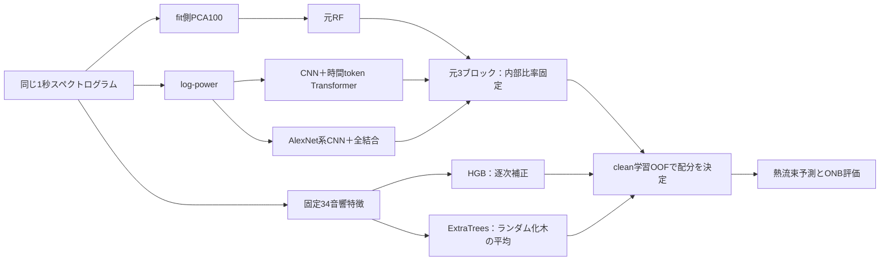

# 5モデルの採用理由と、教授に説明するための進め方

2026-10-06。本人は従来のRF・Conformer・AlexNetを保持し、追加する2モデルも含めて採用理由を明確にしたいと指定した。ここでは、実装上の構造、期待する役割、対応実験で確かめた利得、まだ示せていない必要性を分ける。

**5モデルは「従来3との比較を保ちながら、異なる入力要約と学習方式を追加する研究上の主構成」として採用する。** 全5つが精度上必須、あるいは5つが常に4つより優れるという主張にはしない。今回の削除対照では、元RFを外して回帰誤差がわずかに下がる結果も出た。本人の保持方針と性能上の必要性は別の根拠である。

根拠：[元3固定の候補比較](../../experiments/2026-10-06_fixed_three_additions/README.md)、[通常ONBへの組込みと検算](../../experiments/2026-10-06_onb_five_model_integration/README.md)、[各指標の変化](../../experiments/2026-10-06_onb_five_model_integration/metric_changes_summary.md)。

## 1. 5つは何が違うか

| モデル | このコードでの実体・入力 | 追加/保持する理由 | 言い切れないこと |
|---|---|---|---|
| 元RF | XGBRFRegressor、スペクトログラムflatten→fit側PCA100、100木・depth12 | 従来研究と同じ比較軸を保持。深層モデルとは異なる木の回帰対照 | 元RFが5モデルの精度に必須とは未確認。実際の重みは小さい |
| Conformerという表示名のモデル | `cnn_transformer_v2`。log-power、AlexNet系CNN、時間方向7 token、位置埋込み、2 Transformer block、GAP | 局所形状と時間token間の関係を学習する基礎モデル。削除でclean回帰/FNが悪化 | 原論文の標準Conformerの直接再現ではない。attentionだけで気泡時刻を同定しない |
| AlexNet | log-power、5 Conv層、Flatten＋Dense4096×2、回帰出力 | CNN由来の局所形状と全体の組合せを、attention/GAPとは違うヘッドで使う。削除で回帰誤差が悪化 | Conformerと前段CNNが近く、完全に独立な特徴を使うとは限らない。5モデルでの誤報抑制の必須性は未確認 |
| HGB | 固定34特徴→150段階のHistGradientBoosting回帰。leaf31、最小leaf20、L2=1、early stoppingなし | 帯域power・比率・周波数形状を少数変数として直接使い、逐次残差補正で元3の失敗を補う。HGB4にはq100の利点がある | 時間順序を捨てる。強雑音で単体FP88の分割があり、HGB単体を万能な雑音モデルとはしない |
| ExtraTrees | 同じ固定34特徴→256本のランダム化回帰木の平均。最小leaf2、max_features1、bootstrap=False | HGBとは異なる分岐・木の平均を使う。同入力比較の9候補から両seedのclean OOFで選ばれ、回帰と強雑音の絶対誤差を改善 | HGBと同じ入力、残差も相関する。5対ExtraTrees4の追加差は小さい。物理音源の同定とは別 |

モデルの実体は[base_regression.py](../../code/utils/models/regression/base_regression.py)、追加2は[acoustic_regression.py](../../code/utils/models/regression/acoustic_regression.py)、登録は[onb_defaults.py](../../code/utils/config/onb_defaults.py)。3 kHz・1秒・224×224×1で使う固定特徴であり、22 kHzへ同じHz対応のまま流用しない。

34特徴は、4帯域のlog-powerと全域log-power、2つのlog比率、周波数重心と正規化entropy、時間power CV、125 Hz刻み24帯域の相対log-power。[定義](../../code/utils/dataloading/acoustic_summary_features.py)。熱流束・日付・clean参照・真のSNRをモデル入力に含めない。時間power CVは変動の大きさで、時間順序の特徴ではない。

## 2. なぜHGBとExtraTreesを両方入れるのか

第一に、元3の多くの特徴は画像から学習/圧縮される。34特徴はpowerや周波数形状を明示した別の表現で、元3が共通して見逃したclean21/19例のうち、HGBが7/6、ExtraTreesが6/7を単体で訂正した。入力の違いと、誤りが変わった事実の両方が追加理由になる。

第二に、追加2つは入力を揃えても学習方式が異なる。HGBは逐次補正、ExtraTreesはランダム化した多くの木の平均を使う。今回のHGB単体の−20 FPは88/0、ExtraTreesは0/0。したがって候補の強雑音失敗の出方が異なることを実際に確認した。モデル名が違うというだけでは多様性の証明にしない。

第三に、5モデルは元3MSEに対してclean RMSE35.74→24.67／33.89→25.26、FN32→25／28→19、−20 RMSE81.41→76.31／81.41→73.57、全7条件FP0だった。一方、ExtraTreesだけの4モデルに対する5の差はclean RMSE0.07/0.11・FN1/1と小さい。HGBは少しの補完を担うが、5が唯一の最適解という説明はできない。

HGB4のseed43 clean6/18 q100は322.11、5は376.32なので、HGB4の早い到達は5で失われる。−20の同日ではExtraTrees4の434.02から5は376.32へ早まる。この交換を残して、q100とRMSEの両方を読む。

## 3. モデルを1つずつ外すと何が変わるか

基礎予測を変えず、削除後の元モデル群の比率と追加配分をclean OOFだけで再fitした。外側の正解から最良の重みを選ばない。削除による入力・学習そのものの変化ではなく、保存予測を使った統合の対照である。[全70条件](../../experiments/2026-10-06_onb_five_model_integration/model_removal_ablation.csv)。

下表の差は「外した方式−5モデル」、単位kW/m²。正なら外すことで悪化、負なら外すことで改善。FNは外した後の件数。元5のFNはclean25/19、−2048/58、FPはどちらも0。

| 外したモデル | clean RMSE差 43 / 44 | clean FN 43 / 44 | −20 RMSE差 43 / 44 | 判断に使えること |
|---|---|---|---|---|
| 元RF | −0.20 / −0.04 | 25 / 19 | −0.37 / −0.04 | 精度上の必須性は示せない。保持理由は本人方針と従来比較の継続 |
| Conformer | +1.88 / +2.12 | 29 / 30 | −0.63 / +0.21 | clean回帰と見逃しへの有用な寄与がある |
| AlexNet | +0.26 / +0.65 | 23 / 18 | +2.74 / +1.26 | 回帰には寄与するが、除去でFNが減る交換もある |
| HGB | +0.07 / +0.11 | 26 / 20 | −0.96 / +0.27 | 小さいclean補完、雑音回帰の寄与は分割に依存 |
| ExtraTrees | +1.44 / +1.23 | 25 / 22 | +16.70 / +0.52 | 回帰と、特にseed43強雑音の失敗軽減に有用 |

ここから教授へ説明するのは「5モデルすべてが必須」ではなく、「比較軸を保持したうえで有用な補完を確認した」。RFの小さい正の重みを、必要性の証拠として使わない。AlexNetの古いHGB統合での誤報抑制を、新しい5モデルでの必須性へ自動的に読み替えない。

## 4. 重みの決め方も採用理由に含める

元3だけのclean OOF MSEで非負重みを求め、その内部比率を固定する。次に元3ブロック、HGB、ExtraTreesの3配分を同じclean OOFのMSEで求める。元3総量25%以上、追加各5%以上。元3各モデルの比率には1e−6の数値的な正値floorを置き、別runでRFが0になって元3を失うことを防ぐ。43/44はもともと全比率が正で、このguardによる予測変更は数値誤差だけだった。

25%/5%は全メンバー保持の設計条件であり、最適な普遍比率や誤報許容値ではない。外側結果で配分や閾値を選び直さず、真のSNRで統合を切り替えない。重みを保存することで「モデルが5つある」と「予測に5つが参加している」を区別できる。

## 5. 教授へ説明する文案

> 従来のRF、CNN、CNN＋Transformerによる比較を維持しながら、帯域power・比率・周波数形状を明示した34特徴のHGBとExtraTreesを追加しました。画像から学習する表現と音響要約の違いに加え、逐次補正とランダム化した木の平均という学習方式の違いを利用しています。候補と統合重みは学習側で決め、同じ未使用chunkで3・4・5モデルを比較したところ、5モデルは元3に対して回帰誤差と見逃しを改善しました。ただしExtraTreesだけの4モデルとの差は小さく、RFの必須性や5モデルの普遍的な優位までは示せていません。各モデルの削除対照とq100・雑音下の代償を併記します。

説明性は「利用する帯域・要約」「加工による出力変化」「失敗をどこで補うか」を支える。帯域を気泡音と同定したり、attentionや重要度の画像から物理的原因を確定したりしない。同期映像等の追加事実が得られない制約を、本人の宿題へ戻さない。

## 6. 論理的な次工程

| 段階 | 目的・判定する問い | 状態 |
|---|---|---|
| 指標差を確定 | FN減少がRecall/F1/Accuracyにどう対応し、回帰/AUC/近傍で何が交換されるか | 保存150 epochsモデルで7条件を再計算済み。[各指標表](../../experiments/2026-10-06_onb_five_model_integration/metric_changes_summary.md) |
| 通常実行へ接続 | 5単体と、同じOOFを使う元3/HGB4/ExtraTrees4/5/等平均をONBから出せるか | モデルutils、学習、統合、保存、指標、XAI入口まで実装済み。実main・実構造の1 epoch確認完了 |
| 採用理由を測る | どのモデルの除去で回帰/FN/雑音誤差が変わるか | 学習側で重みを再fitする削除70条件を取得済み。元RFの必要性は未確認と明記 |
| 通常150 epochs実行を1回確認 | 標準保存形式で同じ比較を継続できるか。既定seed42なので43/44と完全一致を要求しない | 設定済み、今回の新150 epochs本実行は未実施。既存の150 epochs結果を未完了としてやり直さない |
| 残る不足から限定比較を選ぶ | 低熱流束・強雑音近傍・q100の交換、保持floor境界をどう扱うか | 通常結果を読んでから選ぶ。モデル数増加・新しいgate・全gridを自動追加しない |

次の通常runでも元3＋ExtraTrees4を強い対照として必ず残す。5と4の差が小さくても結果を消さず、5を固定した研究構成と精度・計算量に応じた代替構成の判断を分ける。現データの既知WAV未使用chunk評価であり、未知日・新しい録音の一般性を今回の結果だけで確定しない。

## 7. 構造説明の一次資料

- 元RFは導入済みXGBoost 2.1.4のXGBRF実装。[2.1 RF公式仕様](https://xgboost.readthedocs.io/en/release_2.1.0/tutorials/rf.html)。通常のbootstrap RFと同一の実装とはしない。
- CNNの参照はKrizhevskyら2012だが、現行はlog-power・BatchNorm・回帰headを持つ派生構造。[AlexNet原論文](https://papers.nips.cc/paper_files/paper/2012/hash/c399862d3b9d6b76c8436e924a68c45b-Abstract.html)。
- 時間tokenのattentionの参照：[Transformer原論文](https://arxiv.org/abs/1706.03762)。標準Conformerは別の構造であり、表示名だけで直接再現としない。[Conformer原論文](https://arxiv.org/abs/2005.08100)。
- HGBの逐次補正の参照：[Friedman 2001](https://doi.org/10.1214/aos/1013203451)。実装の正則化・binningは[HGB 1.6公式仕様](https://scikit-learn.org/1.6/modules/generated/sklearn.ensemble.HistGradientBoostingRegressor.html)。
- ExtraTreesの木のランダム化：[Geurtsら2006](https://doi.org/10.1007/s10994-006-6226-1)、[ExtraTrees 1.6公式仕様](https://scikit-learn.org/1.6/modules/generated/sklearn.ensemble.ExtraTreesRegressor.html)。

論文・公式仕様はモデル構造の説明に使う。本研究での優位・物理的意味の根拠は、上記の対応予測・削除対照・入力依存へ限定する。
