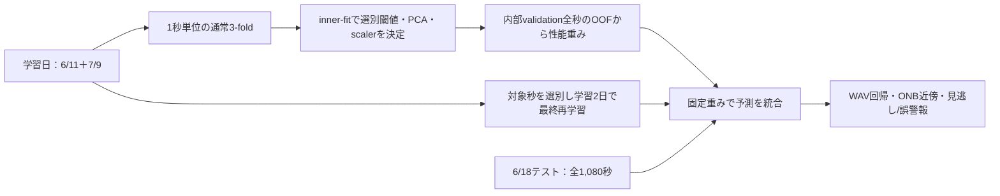

# 9月18日進捗発表：別日評価・音響区間選別と後期計画

2026-09-16更新。従来のファイル名を保持し、本人の新方針へ内容を更新した。完成PPTXではない。[旧XAI中心の原稿](../../experiments/2026-09-16_day_split_spectral_selection/previous_documents/2026-09-18_xai_progress_brief.md)は保持。

## 発表の中心

> アンサンブルによるノイズ劣化抑制の成立条件と理由を調べたい。その前提として、今回は学習とテストを実験日で分け、ONB以上でも音響的に弱い秒を学習から外す処理を追加した。全秒スペクトルと動作確認は終わったが、十分な学習後の改善はこれから確認する。後期はこの検証から統合効果と理由の分析へ進め、12/24頃までに研究を終える計画としたい。

## スライド案（10枚・15分程度の案）

| 枚 | 主題 | 示すもの・伝えること |
|---|---|---|
| 1 | 目的と優先順位 | 沸騰音→熱流束→ONB。学部の劣化抑制から成立条件へ。先に評価とデータを整える |
| 2 | 学習・内部検証・別日テスト | 学習6/11+7/9、内部通常chunk KFold、テスト6/18。テストを重み決定から分離 |
| 3 | 同じ熱流束でも音が違う | [代表PSDと既存STFT](../../experiments/2026-09-16_day_split_spectral_selection/onb_spectra_and_existing_spectrograms.png)。熱流束と音響イベント正解を区別 |
| 4 | ピークの高さと横線 | [同じ縦軸での4秒比較](../../experiments/2026-09-16_peak_height_selection/example_spectra.png)、[閾値操作画面](../../experiments/2026-09-16_peak_height_selection/peak_threshold_review.html)。全2,940秒を出力。2,300 Hz付近の山の高さに横線を引く |
| 5 | 弱い部分を含める程度と残存数 | 7/9の1録音で横線10/1/0.3なら5/13/16秒。暫定1では学習1,860→1,649秒、テスト1,080秒は保持。7/9の最初の2点は全除外 |
| 6 | 検証の状態 | 62テスト、新ルールの実3モデル2 epochs動作確認。本性能と最適閾値は未確認。次は同条件で選別なし/ありを比較 |
| 7 | 修論で答える問い | 別日性能／学習選別の効果／ノイズ下の統合成立条件と理由 |
| 8 | 修論目次 | 背景→実験/音響→手法/評価→別日/選別→ノイズ/統合→理由→結論 |
| 9 | 後期計画 | 9月評価、10月比較、11月分析、12/10主結果、12/24研究終了、1月修論 |
| 10 | 直近タスク・相談 | 本比較、7/9原記録照合、研究順序・構成・正式締切 |

300 epochsの新結果が発表前に得られたら、同じテスト集合・条件で**完了した選別なし/あり**だけを6枚目に入れる。途中run、旧日内の数値、2 epochsの値を混ぜて改善を主張しない。

## 分割図

話す内容：「学部コードは1秒配列を通常KFoldで分けていました。今回はこの分割を学習内の重み決定に使い、主評価には別日の6/18を使います。内部では同じWAVを共有しますが、その数値は未知録音の成績とは区別します。」

## 選別の説明

- ONB未満は残し、ONB以上はclean音の2,100–2,500 Hz内の最大PSDが1e-9以上の秒を残す。図の縦軸×10⁻⁹で横線1。日別の分位点ではなく、山の高さへの固定線である。
- 横線を下げれば、強い山の前後にある弱い山も入る。隣の秒を自動追加せず、各秒の高さで判断する。付録のPowerとは尺度が違い、数値は今回の線形図で確認する。
- 全周波数・付加ノイズ版に同じ元WAV/秒の判定を適用する。付加ノイズの強さで採否を変えない。
- ラベルを変えず、テストと内部validationを削らない。
- 7/9の全除外を「沸騰していなかった」と解釈しない。録音対応・計測条件・実験上のONBと音響の対応を確認する。
- 1は学習日の低熱流束領域と弱い山を比較した探索的候補。最適性は未検証。データ不足対策は本人指定で保留。[詳しい根拠](../../experiments/2026-09-16_peak_height_selection/README.md)。

## 計画を話す原稿

「修論は、第1章で目的、第2章で実験と音響特徴、第3章でモデルと評価、第4章で別日性能と学習選別、第5章でノイズ下の単体・統合、第6章で残差と特徴利用から理由を分析し、第7章で成立条件と限界をまとめる構成を考えています。」

「9月は分割と選別、10月はノイズと必要な統合方式、11月は有効な条件とそうでない条件の理由を調べます。12月10日を主結果、24日を研究・解析の終了目標にします。背景や方法は10月から書き、1月に全体原稿を仕上げたいと考えています。」

[階層タスク・判断点](2026-09-16_second_semester_plan.md)、[修論目次・必要な証拠](2026-09-16_master_thesis_outline.md)。

旧3/22 kHz比較、IG修正、5方式の数式は予備資料。相談事項は[SOAP下書き](../progress/2026-09-18_weekly_progress_draft.md)と統一する。教授に送った相談文への回答・承認は未確認として扱う。
