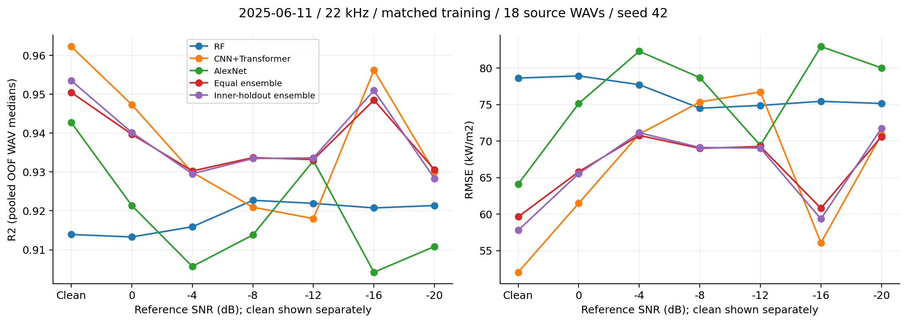
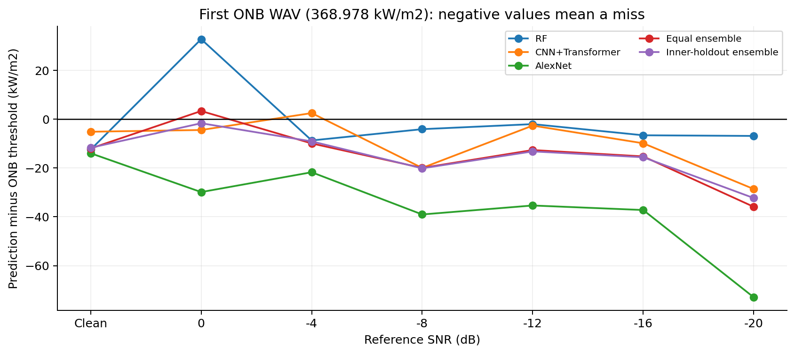
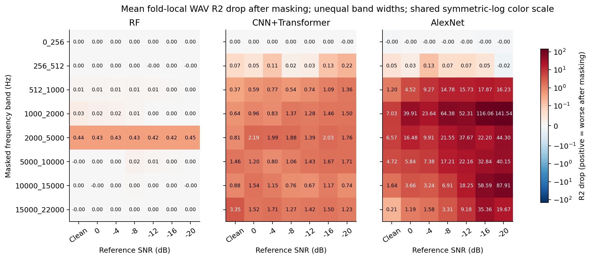
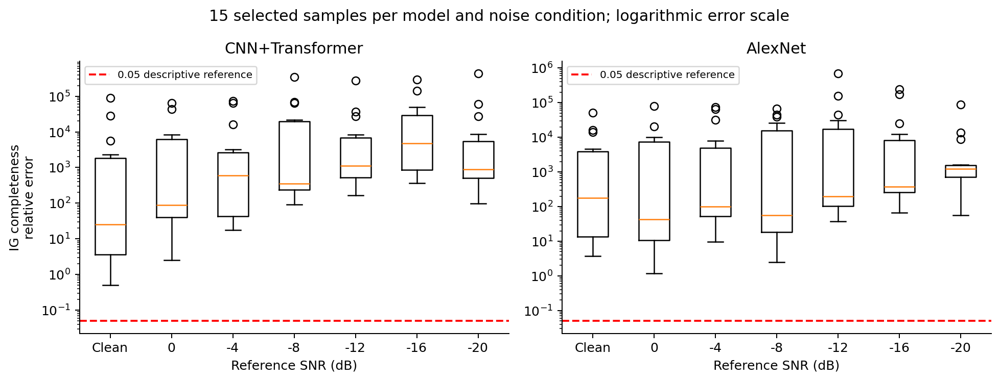
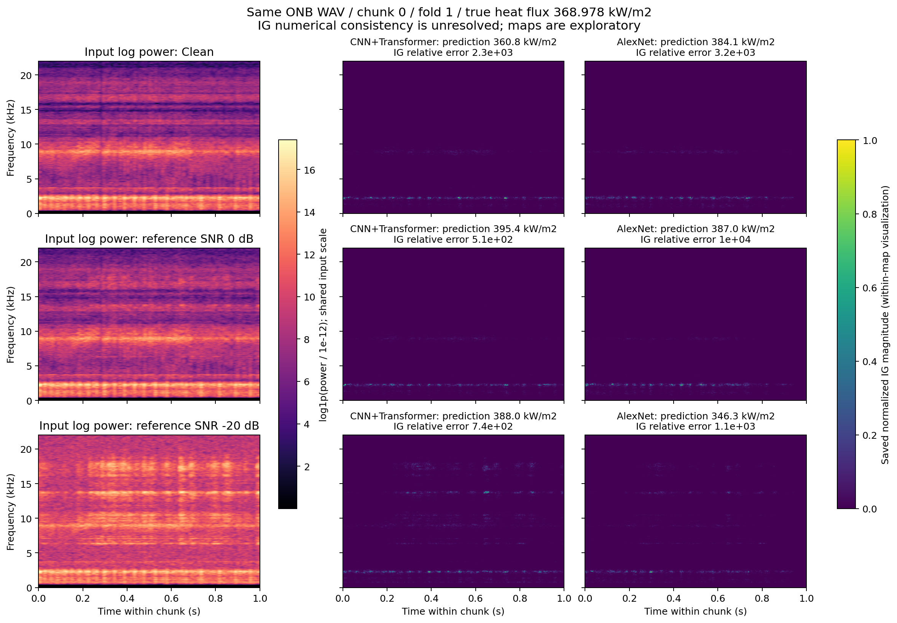

# 22 kHz・全7ノイズ条件の解析結果

> 同日後続: 追加の3 kHz完了結果を含む[2帯域比較・卒論照合・原因分析](../2026-09-15_onb_frequency_comparison/analysis.md)を作成した。以下は22 kHz単独解析時点の記録として保持する。

解析日: **2026-09-15**。本人実行の `20260915_selected_log_architecture`、22 kHz・hash `2b4cef` を対象に、12:17 JSTに数値を固定した。全7条件完了。学習コードと元結果は変更していない。

## 結論

1. **CNN＋Transformerは7条件中5条件で単体最高R²**。無雑音では0.9623。ノイズ強度に対する変化は単調ではなく、条件別の順位も変わる。
2. **アンサンブルは条件によって有効**。単純平均は4/7、inner holdoutは2/7条件で最良単体を上回る。最大の改善は−8 dB。それ以外の改善幅はR²で0.001未満。
3. **ONBの最初の点の検知は未解決**。全35組のモデル×条件でWAV ROC-AUC=1.0だが、32組は最初のONB WAVを見逃す。
4. **RFの2–5 kHz依存は一貫**。全21組のfold×ノイズで同帯域マスクのR²低下が最大。深層モデルは異なる帯域依存と大きなマスク応答を示す。
5. **IGの数値整合性は未解決**。210例すべてで寄与合計と予測差が不一致。共通マスクと診断結果を発表の中心にし、IG画像は検証途中の観察として示す。

## 1. 採用条件と検証

| 項目 | 確認内容 |
|---|---|
| 実験・入力 | 収録日2025.06.11、`waterflow_20260817_1s`、1秒powerスペクトログラム224×224、周波数上限22 kHz |
| ノイズ | 無雑音、reference SNR 0 / −4 / −8 / −12 / −16 / −20 dB |
| 学習 | `within_day + matched`、seed 42。各条件でそのノイズを使って再学習 |
| 分割 | 元WAV分離3-fold、学習12 WAV・720 chunks、検証6 WAV・360 chunks。同じ分割を7条件で確認 |
| 母数 | 各条件18 WAV・1,080 chunks。同じ録音の加工条件であり、独立実験7回ではない |
| モデル | RF（XGBRF＋学習側PCA100）、CNN＋Transformer、AlexNet。統合は単純平均・inner holdout |
| 実学習 | 深層2モデルの全7条件で300 epochs・batch size 16、メモリ不足による途中採用なしと記録。学習サマリーはfold間の同値をまとめて保存 |
| 主評価 | 全foldの学習外予測を元WAVごとの中央値にしてpool。chunkのfold平均とは区別 |
| ONB | 閾値368,978.105 W/m²、陽性8 WAV・陰性10 WAV。閾値±10%は**1 WAV** |
| 識別 | run hash `2b4cef`、instance `093628`。7条件のmanifest・完了印を照合 |
| 検算 | 35組のR²・RMSE・Recall・ROC-AUC、chunk→WAV中央値を照合。63組のマスク前R²もfold予測と一致 |
| 説明性 | 63個のfold×モデル出力。選択例315件、IG210例、Grad-CAM105例、TreeSHAP105例、共通マスク756行 |

根拠: [実行一覧](snapshot_20260915/run_inventory.csv)、[分割監査](snapshot_20260915/split_audit.csv)、[学習サマリー](snapshot_20260915/training_summary.csv)、[固定時点の出典と検算](snapshot_20260915/snapshot_manifest.json)、[追加検算](diagnostics_20260915/verification.json)。別途12:11に始まった3 kHzのrunは今回に混ぜていない。

## 2. 予測性能とアンサンブル

### WAV中央値のR²

太字は条件ごとの最高値。無雑音は数値SNRではなく独立したカテゴリとして表示。

| reference SNR | RF | CNN＋Transformer | AlexNet | 単純平均 | inner holdout |
|---|---:|---:|---:|---:|---:|
| 無雑音 | 0.91394 | **0.96228** | 0.94276 | 0.95048 | 0.95351 |
| 0 dB | 0.91329 | **0.94734** | 0.92138 | 0.93971 | 0.94017 |
| −4 dB | 0.91591 | 0.92990 | 0.90571 | **0.93026** | 0.92954 |
| −8 dB | 0.92272 | 0.92095 | 0.91381 | **0.93371** | 0.93346 |
| −12 dB | 0.92194 | 0.91803 | 0.93291 | 0.93321 | **0.93364** |
| −16 dB | 0.92076 | **0.95620** | 0.90422 | 0.94852 | 0.95096 |
| −20 dB | 0.92138 | 0.93004 | 0.91085 | **0.93058** | 0.92831 |



[指標CSV](snapshot_20260915/wav_median_metrics.csv)、[最良単体との差](snapshot_20260915/model_comparison.csv)、[図PDF](snapshot_20260915/figures/performance_by_noise.pdf)。

- CNN＋TransformerのR²は0.9180〜0.9623、RMSEは52.1〜76.7 kW/m²。RFはR² 0.9133〜0.9227と条件間の幅が小さい。これは各条件に合わせて学習した結果であり、未知ノイズへの耐性は別途検証する。
- 単純平均は−4/−8/−12/−20で最良単体を上回る。最大の改善は−8の**ΔR²=+0.010985**。残りは+0.000292〜+0.000543で、反復なしに優位を確定しない。
- inner holdoutは−8/−12で最良単体を上回る。元WAVを分離した内側評価で重みを決めても、少数データから選ぶ重みの外側成績には変動が残る。[重み](snapshot_20260915/ensemble_weights.csv)
- 全域誤差はONB前に多い。CNN＋Transformerでは二乗誤差総和の87.5〜95.9%が閾値未満の10 WAVに由来し、最小熱流束の1 WAVだけで27.5〜67.0%を占める。全域R²とONB捕捉の改善は分けて考える。[WAV別誤差寄与](diagnostics_20260915/wav_error_contributions.csv)
- 深層2モデルのWAV残差相関は0.849〜0.954。誤りが似る傾向があり、統合による補完が条件に依存するという解釈と整合する。相関だけで改善原因を断定しない。[残差相関](snapshot_20260915/residual_correlations.csv)

−16 dBのCNN＋Transformerが−12より高精度になるなど非単調性がある。各条件で再学習するため、学習の変動と入力変化などが混ざる。ノイズが物理情報を改善したとは結論しない。同じ3ノイズの9/14試行とも深層モデルの値は異なる。[前回run比較](diagnostics_20260915/previous_run_comparison.csv)を保持し、seedが同じというだけで完全再現と扱わない。

## 3. ONB付近の結果

全35組でWAV ROC-AUC=1.0、誤警報=0/10 WAV。ONB点を検知したのは次の3組で、残る32組はその点だけを見逃し、Recall=7/8=0.875だった。

| ノイズ | 最初のONB WAVを検知した方式 | 閾値に対する予測差 |
|---|---|---:|
| 0 dB | RF | +32.826 kW/m² |
| 0 dB | 単純平均 | +3.374 kW/m² |
| −4 dB | CNN＋Transformer | +2.524 kW/m² |



無雑音のCNN＋TransformerはR²=0.9623でも、ONB WAV中央値は**363.860 kW/m²**で閾値368.978より5.118低く、陰性判定となる。見逃した32組は次の427.276 kW/m²の測定点で陽性になる。差は**1測定点・58.298 kW/m²**。秒単位の遅れではない。2 WAV連続陽性の開始点を使っても今回の結果は同じ。

陽性と陰性の予測値を順序づけられていても、予測値と物理的なONB閾値の対応にはずれが残る。評価データを見て閾値を下げ、その同じデータで改善を主張しない。校正・閾値設定は、発表後に学習側で決める手順と追加近傍データを検討する。

±10%に1 WAVしかないため、`rmse_onb`は実質的にその1本の絶対誤差。1秒chunkの陽性率と60秒録音の中央値判定も異なる。[ONB遷移](snapshot_20260915/onb_transitions.csv)、[WAV予測](snapshot_20260915/wav_predictions.csv)、[測定点別予測図](diagnostics_20260915/operating_point_predictions.png)。

## 4. 共通帯域・時間マスク



図は**各foldの6 WAVで算出したR²低下の3-fold平均**。主性能表の18 WAV pooled R²と混ぜない。赤は悪化、青は改善。値の幅が大きいため共通の対称対数色尺度を用いた。帯域幅は等しくない。

| モデル | fold別の最大低下帯域（21組） | 読み取り |
|---|---|---|
| RF | **2–5 kHz: 21/21** | この帯域の平均ΔR²は0.421〜0.448で一貫。他帯域の低下は小さい |
| CNN＋Transformer | 2–5 kHz: 8/21、15–22 kHz: 7/21、その他6/21 | 帯域とfoldによる違いがある。平均最大は無雑音15–22、−12は5–10、他5条件は2–5 kHz |
| AlexNet | **1–2 kHz: 15/21**、5–10: 3/21、2–5: 2/21、10–15: 1/21 | 3-fold平均の最大は全7条件で1–2 kHz。マスクへの反応が大きい |

AlexNetの1–2 kHzマスクによる平均ΔR²は無雑音7.03、−20 dBで141.54。これは「141倍重要」という意味ではない。R²は負の大きな値も取り得るため、予測が大幅に崩れたことを示す。部分的なゼロ置換が学習時と異なるスペクトルを作る影響を含む。物理的重要度やノイズ耐性を、この値だけで順位づけない。

時間方向の1/4区間マスクでも、3-fold平均ΔR²の範囲はRF −0.012〜0.036、CNN＋Transformer 0.100〜0.562、AlexNet 0.236〜110.189。AlexNetの大きな応答は特定周波数だけに限らない可能性がある。少数例でゼロ以外の置換値や帯域保持・再学習との整合を調べることが次の候補。

[全756行](snapshot_20260915/group_mask_performance.csv)、[帯域・時間集計](snapshot_20260915/mask_aggregates.csv)、[最大帯域一覧](snapshot_20260915/top_mask_bands.csv)。

## 5. 説明性の信頼性

| 項目 | 今回の結果 | 解釈 |
|---|---|---|
| TreeSHAP再構成 | 105例、絶対誤差中央値0.262、最大2.046 W/m² | PCA成分への分解は数値的に整合。成分を物理周波数と同一視しない |
| IG completeness | **210/210例が相対誤差0.05超** | 寄与合計で予測差を説明できていない。0.05は説明用の目安で、事前の合否基準ではない |
| 入力小摂動への安定性 | 420行、絶対値mapのPearson相関中央値は両深層モデル約0.9999 | 図の局所安定性は高い。整合性・物理妥当性とは別 |
| 最終層ランダム化 | 210例、相関中央値はCNN＋Transformer 0.644、AlexNet 0.626 | 変化するが形状の類似も残る。最終層だけの部分診断 |
| Grad-CAM | AlexNetの105例を出力 | 粗い局在の補助。符号付き寄与分解ではない |

IGのcompletenessは、寄与総和が入力とbaselineの予測差に一致する性質。[Sundararajan et al., §3](https://arxiv.org/html/1703.01365v2#S3)。視覚的な自然さだけで説明手法を評価できない点、モデル依存性を診断する意義は[Adebayo et al.](https://arxiv.org/abs/1810.03292)に対応する。



条件別中央値でも、相対誤差はCNN＋Transformer 25.4〜4,823、AlexNet 43.0〜1,249。分母が小さいためだけではなく、−20の絶対不一致中央値はそれぞれ約1.96×10⁸、1.13×10⁹ W/m²。signed配列の総和とCSVは210例すべて一致しており、今回の集計による桁ずれではない。

### 原因候補の確認

現行実装はbaseline=0から**生power空間**で補間し、64分割の台形則で勾配を積分する。モデル先頭には `log1p(max(power, 0) / 1e-12)` がある。正の側ではゼロ付近のlog勾配が急に変化するため、均等な積分点で変化を捉えきれない可能性がある。

同じONB chunkの正のpower中央値を使い、**log変換だけ**を数値計算した補助例:

| ノイズ | power中央値 / 1e−12 | log変換の厳密な差 | 64分割台形近似 | 相対誤差 |
|---|---:|---:|---:|---:|
| 無雑音 | 2,710 | 7.905 | 25.869 | 2.272 |
| 0 dB | 3,467 | 8.151 | 31.789 | 2.900 |
| −20 dB | 27,770 | 10.232 | 221.684 | 20.666 |

当該機構で誤差が生じ得ることを示す補助例であり、**学習済みネットワーク全体の原因確定やIG再計算ではない**。出力の逆変換係数はコード上 `1/scaler.scale_` と確認した。

次は少数の保存モデルで、積分経路・点数・baselineの収束を比べる。64→128だけで解決すると仮定しない。log空間を説明する場合は説明対象と経路が変わることを明記する。通常runはモデル本体を永続保存していないため、必要なら限定再学習とモデル保存を伴う別作業にする。今回、学習やIG修正は行っていない。

根拠: [IG診断](snapshot_20260915/ig_diagnostics.csv)、[TreeSHAP](snapshot_20260915/treeshap_pca_summary.csv)、[安定性](snapshot_20260915/input_stability.csv)、[ランダム化](snapshot_20260915/top_layer_randomization_sanity.csv)、[log補助計算](diagnostics_20260915/log_frontend_quadrature_probe.csv)、[IG実装](../../code/utils/explainability/spectrogram_explainers.py)、[単位処理](../../code/utils/explainability/training_integration.py)。

## 6. 同じ入力の代表画像



元WAV `index=11.3.69E+05` のchunk 0、fold 1、真値368.978 kW/m²。無雑音・0・−20で元WAV IDとchunk番号を照合。入力は共通log-power尺度、IGは保存時の画像ごとの正規化を保持した科学プロット。

入力には低周波の帯状・点状構造があり、−20では高周波側の強度も増える。IGには低周波構造と対応して見える部分があるが、図中の相対誤差は大きい。これを「気泡イベントを検知できた」と解釈するには数値整合と同期した独立観測が必要。

代表chunkは録音全体の判定ではない。無雑音AlexNetはこのchunkを384.065 kW/m²と陽性予測するが、録音中央値は355.036 kW/m²で陰性。代表図と全体評価を併記する。

`near_onb_*`はfold内選択名で、±10%を保証しない。315選択例のうち±10%内は42例で、独立した近傍録音42本ではない。ONB・失敗などを意図的に選んだ例なので、全入力での割合の推定に使わない。[代表9例](diagnostics_20260915/representative_samples.csv)、[全例の対応](snapshot_20260915/sample_correspondence.csv)。

## 7. 発表と次の作業

金曜は、この7条件を主材料に「性能→共通マスク→代表画像→信頼性→残る問い」の順で話す。全周波数の完了を待たず原稿を仕上げられる。3 kHzが揃えば、条件を照合し別解析として追加する。

発表後は本人の方針どおりONB近傍評価・新実験・同時計測へ進む。説明性の追加は、少数例でIGの収束とマスク置換の影響を確認することを優先候補とする。一般化はclean_only、別日の順で代表条件を確認する。

先生への相談: (1)共通マスクと信頼性診断を中心に説明すること、(2)近傍1本の制約を追加測定でどう補うか、(3)同期した正解の観測源、の3点。

## 再現・出力

- [analyze_results.py](analyze_results.py): 元runの抽出・検算・主要4図。
- [supplement_diagnostics.py](supplement_diagnostics.py): 追加検算、誤差寄与、前回比較、代表画像、log補助例。
- `snapshot_20260915/`: 23 CSV、出典673ファイルのhash、4図のPNG/PDF。学習サマリーだけは別周波数と共有する元CSVから対象行を切り出して固定。
- `diagnostics_20260915/`: 追加CSV・検算、2図のPNG/PDF、未加工の元画像9枚。

既存スナップショットは上書きせず、新しい空ディレクトリを指定する。

```powershell
python -X utf8 experiments/2026-09-15_onb_22khz_noise_sweep/analyze_results.py --output <new-snapshot-directory>
python -X utf8 experiments/2026-09-15_onb_22khz_noise_sweep/supplement_diagnostics.py --snapshot <new-snapshot-directory> --output <new-diagnostics-directory>
```

[9/14の固定結果](../2026-09-15_research_status_snapshot/README.md)は過去runの証拠として保持。今回の35組と数値を混在させない。

最終確認: [検証記録](final_verification.json)。23 CSVの再生成がbyte単位で一致し、学習サマリーを除く元結果672ファイルのhashを再照合した。共有サマリーは別周波数の実行で追記され得るため、抽出した22 kHzの35行の再現を確認した。図は保存配列から作成し、軸と代表例の対応を目視確認した。
