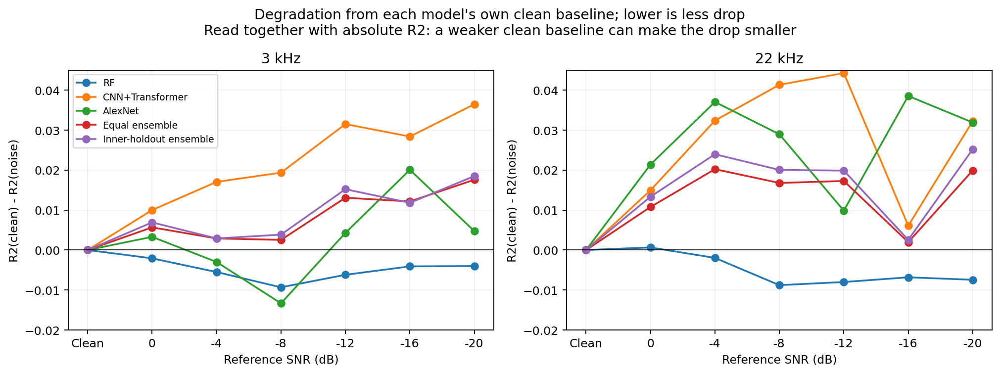
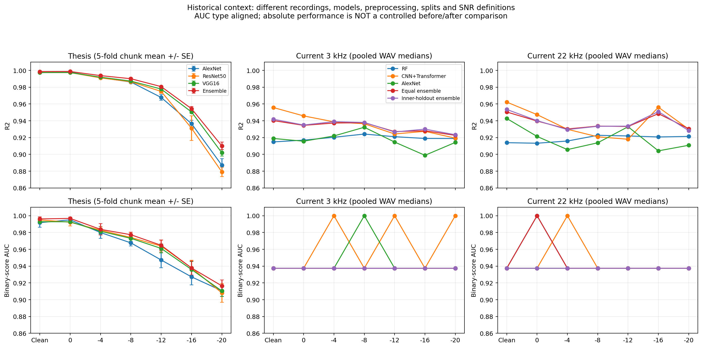
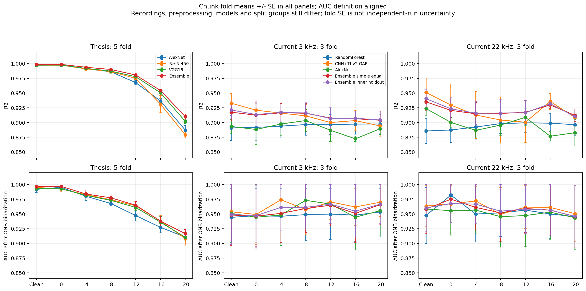
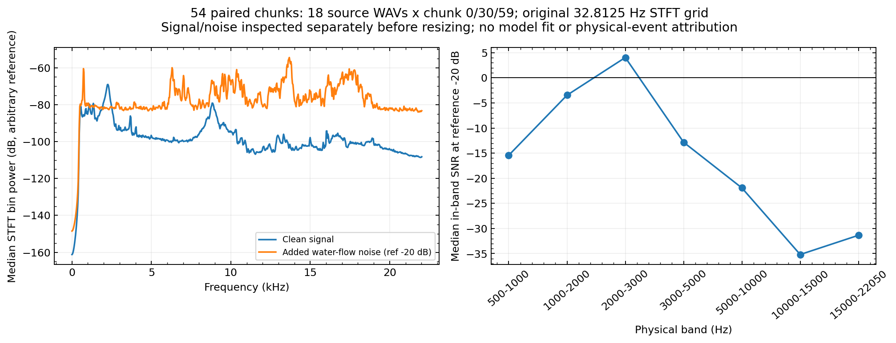
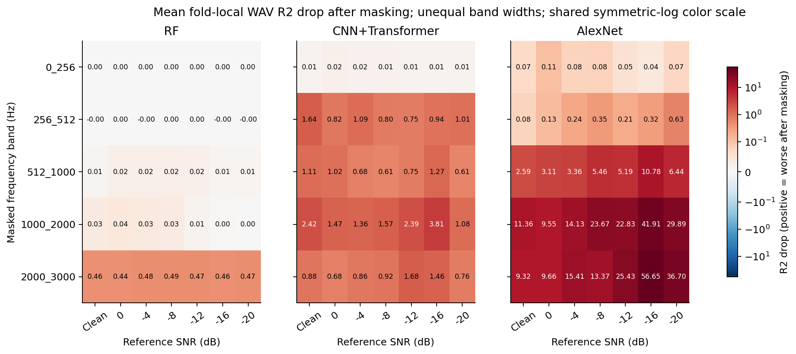

# 3 kHz・22 kHzのノイズ傾向、学部結果との対応、説明性の分析

解析日: **2026-09-15**。本人の追加回答に従い、**完了済みの2025.06.11・3 kHz / 22 kHz・各7ノイズ**に限定した。進行中runと他実験日の新結果は対象外。学習コード・既存結果は変更していない。

本人の目指す結論と背景は、今後も参照する[修士研究の仮説・希望](../../docs/research_plan/2026-09-15_master_thesis_hypothesis.md)に別記した。本書はその仮説に対して、今回何が分かったかを記録する。

## 1. 結論

1. **3 kHzでは本人の見立てを部分的に支持する。** CNN＋Transformerは無雑音R²=0.9558から−20 dBで0.9194へ低下。inner holdoutは−4〜−20の5/7条件で最良単体を上回り、−20では0.9234となる。
2. **22 kHzも「劣化も統合効果もない」結果ではない。** 無雑音→−20で深層2モデルのR²は約0.032低下し、単純平均の低下は0.0199。途中の回復が大きく、統合の優位条件が3 kHzと異なる。
3. **両帯域でRFはほぼ横ばい。全モデル・全指標の単調劣化は確認できない。** 3 kHzのCNNにも−12→−16で小さな回復があり、AUCにはR²と異なる傾向がある。
4. **帯域で同じ結果を期待できない具体的な理由が見えた。** ノイズの帯域別強度、使う周波数、224列への変換が異なる。54区間の波形診断では、reference −20でも2–3 kHzの帯域内SNRは中央値+4.05 dB、10–15 kHzは−35.18 dBだった。
5. **22 kHzの回復を生むモデル内部の原因までは未確定。** −12→−16のCNNの改善は、最低熱流束の1 WAVが正味の二乗誤差減少の約71.6%を占める。ONBの識別改善を意味しない。再学習の変動と帯域利用を分離する検証が必要。
6. **説明性の状況は3 kHzでも共通。** RFのTreeSHAPは数値整合、共通マスクは利用帯域の違いを示す。一方IGは3 kHzでも210/210例で大きな不一致があり、22 kHzだけの問題ではない。

## 2. 条件と根拠の固定

| 項目 | 確認内容 |
|---|---|
| 3 kHz | hash `6f5512`、instance `121111`、12:11開始の7条件すべて完了 |
| 22 kHz | hash `2b4cef`、instance `093628`、09:36開始の7条件すべて完了。[先行解析](../2026-09-15_onb_22khz_noise_sweep/analysis.md)を保持 |
| 共通条件 | `waterflow_20260817_1s`、within_day + matched、300 epochs、深層batch 16、seed 42、3モデル・2統合方式 |
| 分割 | 同じ18元WAV、各60 chunks。3-foldの学習12/評価6 WAVが全14条件で一致 |
| 比較の統制 | 保存validation_configの差は入力上限・XAI対象上限・run instanceのみ。全7ノイズで3/22 kHzのchunk metadataが一致 |
| 指標 | 主表は元WAV内中央値を全foldでpoolしたR²。chunkのfold平均も別図で照合 |
| ONB | 閾値368,978.105 W/m²。陰性10 WAV、陽性8 WAV。±10%に1 WAV |
| 検算 | WAV性能70組、chunkのR²/二値AUC70組、マスク前性能126組、IG配列総和420例を確認 |
| 波形補助診断 | 各WAVのchunk 0/30/59、計54区間。clean/−20×3/22 kHzの216保存配列を再構成して照合。最大絶対差3.56×10⁻¹⁵以下 |

14条件は同じ18録音を加工したもの。14回の独立実験でも、別日の再現性確認でもない。seedが同じでも、帯域以外の学習変動が完全に消えた対照実験とはしない。

根拠: [3 kHzスナップショット](snapshot_3khz/snapshot_manifest.json)、[比較検算](comparison/verification.json)、[chunk検算](chunk_comparison/verification.json)、[波形検算](input_probe/verification.json)。入力再構成は信号・ノイズの保存パラメータとの対応を確かめたもので、モデルを再学習したものではない。

## 3. 3 kHzの追加結果と統合効果

### 3.1 全7条件のWAV R²

| reference SNR | RF | CNN＋Transformer | AlexNet | 単純平均 | inner holdout |
|---|---:|---:|---:|---:|---:|
| 無雑音 | 0.91488 | **0.95582** | 0.91897 | 0.94025 | 0.94187 |
| 0 | 0.91696 | **0.94582** | 0.91568 | 0.93457 | 0.93496 |
| −4 | 0.92038 | 0.93877 | 0.92196 | 0.93735 | **0.93897** |
| −8 | 0.92420 | 0.93647 | 0.93230 | 0.93771 | **0.93802** |
| −12 | 0.92107 | 0.92431 | 0.91469 | **0.92717** | 0.92666 |
| −16 | 0.91897 | 0.92743 | 0.89891 | 0.92810 | **0.93007** |
| −20 | 0.91889 | 0.91935 | 0.91423 | 0.92267 | **0.92338** |

単体最高はCNN＋Transformerが7/7。単純平均が最良単体を上回るのは−8〜−20の4/7、inner holdoutは−4〜−20の5/7。−4のinner改善は+0.000204と小さい。−20はinnerでΔR²=+0.004030、RMSEは76.123→74.196 kW/m²（約2.5%減）。1 seed・18 WAVで優位性の確定まではしない。[比較値](snapshot_3khz/model_comparison.csv)

### 3.2 「劣化が小さい」と「強ノイズで高精度」を両方見る

| 帯域 | モデル | 無雑音R² | −20 R² | 低下量（無雑音−−20） |
|---|---|---:|---:|---:|
| 3 kHz | RF | 0.91488 | 0.91889 | −0.00401 |
| 3 kHz | CNN＋Transformer | 0.95582 | 0.91935 | 0.03647 |
| 3 kHz | AlexNet | 0.91897 | 0.91423 | 0.00475 |
| 3 kHz | 単純平均 | 0.94025 | 0.92267 | 0.01758 |
| 3 kHz | inner holdout | 0.94187 | 0.92338 | 0.01849 |
| 22 kHz | RF | 0.91394 | 0.92138 | −0.00744 |
| 22 kHz | CNN＋Transformer | 0.96228 | 0.93004 | 0.03224 |
| 22 kHz | AlexNet | 0.94276 | 0.91085 | 0.03191 |
| 22 kHz | 単純平均 | 0.95048 | 0.93058 | 0.01990 |
| 22 kHz | inner holdout | 0.95351 | 0.92831 | 0.02520 |

3 kHzのCNNと比べると、innerのR²低下量は約49%小さい。ただし無雑音ではinnerがCNNより0.01394低い。**劣化量だけで「耐性が約2倍」とは言わない。** RFや3 kHz AlexNetの低下量はさらに小さいが、強ノイズ時の絶対R²は統合より低い。[低下量・RMSE・卒論式の相対低下率](comparison/degradation_summary.csv)

22 kHzでは単純平均が4/7、innerが2/7で最良単体を上回る。−8の単純平均の改善+0.010985は、3 kHzの最大改善より大きい。−20では単純平均0.93058が最良単体0.93004をわずかに上回るが、inner0.92831は下回る。**22 kHz全体を失敗と呼ぶより、統合方式・条件により補完が成立する範囲が変わったと捉える**方が数値に合う。

### 3.3 補完の解釈

3 kHzではノイズ増加に伴って高精度だったCNNの成績がRF・AlexNetへ近づき、統合が有利になる条件が増える。深層2モデルの残差相関は0.825〜0.952、RFとCNNは0.833〜0.893で、共通の誤りも多い。平均は共通誤差を取り除けないが、異なる誤差の一部を相殺できる。

[二乗誤差の分解](comparison/ensemble_error_decomposition.csv)には、単体平均誤差、予測のばらつき、平均予測の誤差を記録した。これは説明用に**WAV中央値を平均した場合**の恒等式を検算したもの。実装はchunk予測を統合してからWAV中央値を取るため、順序による差も保存した。恒等式だけで実装の改善を完全に説明したとは扱わない。

## 4. 卒論の比較図と、今回のAUCが違う理由

### 4.1 原本の確認

[卒論PDF](../../研究進捗報告/8121048_柴崎陸_最終投稿卒論.pdf)のPDF 25ページ（本文21頁）Table 4.2.1/4.2.2、PDF 26ページ（本文22頁）**Fig. 4.2.2/4.2.3**を実際に読み、図も確認した。[図がある原ページ](thesis_pages/page_26.png)、[抽出数値](comparison/thesis_table_values.csv)。

卒論では、無雑音→−20のアンサンブルがR² 0.9986→0.9101、AUC 0.9962→0.9165。本人の記憶どおり全体として劣化し、統合が低下を抑える図である。ただし当時も無雑音→0の微増や、AUCで単体が統合をわずかに上回る条件があり、「全点で必ず単調・統合最高」ではない。

### 4.2 比較条件の違い

| 観点 | 学部卒論 | 今回 |
|---|---|---|
| 音響データ | 当時の3回の実験をまとめたデータ | 2025.06.11の18 WAV |
| 単体モデル | AlexNet / ResNet50 / VGG16 | RF（XGBRF＋PCA）/ log-power CNN＋Transformer / log-power AlexNet |
| 分割 | 通常5-fold、chunk単位 | 元WAV分離3-fold |
| 表示 | chunkのfold平均・標準誤差 | 主評価はWAV中央値をpool。chunk平均・SEも別途保存 |
| ONB閾値 | 3実験のONB熱流束の平均（卒論§3.7.1） | 当該実験日の確認されたONB測定点 |
| AUC | 二値化した予測から算出（卒論§3.7.1） | 連続予測ROC-AUCと二値化後AUCを区別 |
| 入力・ノイズ | 旧振幅画像・各chunk min–max、旧ノイズ定義 | 絶対power保持、深層はlog変換、固定global RMS基準 |
| 統合の重み | 評価foldの決定係数を重みに利用（卒論§3.7.1） | 単純平均／外側評価WAVを使わないinner holdout |

旧前処理の詳細は[8/17監査](../../docs/research_plan/2026-08-17_noise_accuracy_reversal_investigation.md)と残存コードに基づく。学部当時の完全なコード版・環境を復元したものではない。学部成果は当時の観察として残し、元WAV混在や重み選択が絶対値に与えた影響は現在の評価と分ける。

### 4.3 AUC定義と集計単位を揃えても、曲線は異なる

両帯域の計70組で**WAV連続ROC-AUC=1.0**。一方、二値AUCは0.9375または1.0で、単調な劣化曲線にはならない。今回、誤警報が0で、陽性8 WAV中の最初の1本を見逃すかどうかで値が決まるためである。二値スコアのAUCはこの場合(感度＋特異度)/2で、見逃すと(7/8＋1)/2=0.9375となる。

3 kHzは35組中31組、22 kHzは32組で最初のONB WAVを見逃す。3 kHzで検知したのはCNNの−4/−12/−20、AlexNetの−8。**3 kHzの両アンサンブルは全7条件でそのWAVを見逃す。** −20ではCNN単体がONB点を捉えるのに、統合では捉えない。回帰での統合効果をONB検知の改善へそのまま読み替えられない。[ONB差と指標](comparison/wav_metrics_both_frequencies.csv)

さらに、**現在の値もchunkのfold平均・二値AUCに揃えた図**を作った。3 kHz CNNのchunk R²は0.93281→0.89413へ低下するが、二値AUCは0.95370→0.96991へ上がる。したがって今回の相違はAUC定義やWAV中央値だけでは説明できない。回帰誤差の大小と、ONBの固定閾値をまたぐ誤りの数は異なる量である。

上図は全パネルがchunk fold平均±SE。ただし録音、分割、モデルなどは異なるので、統制された新旧比較ではない。foldのSEを独立実験・独立seedの不確かさとは扱わない。全14条件の比較は[WAV三指標図](comparison/frequency_metric_comparison.png)も参照。

## 5. 周波数によって傾向が異なる原因はどこまで分かったか

### 5.1 確認できたこと：ノイズは周波数一様ではない

全18録音から、結果を見て選ばない固定位置（0/30/59秒）の54区間を採用。元信号と付加ノイズを別々にSTFTし、**リサイズ前の共通32.8125 Hz刻み**で帯域パワー比を計算した。これは実現SNRの補助診断で、54独立録音の統計ではない。

| 帯域 | reference −20での帯域内SNR中央値 |
|---|---:|
| 0.5–1 kHz | −15.42 dB |
| 1–2 kHz | −3.45 dB |
| **2–3 kHz** | **+4.05 dB** |
| 3–5 kHz | −12.83 dB |
| 5–10 kHz | −21.92 dB |
| 10–15 kHz | −35.18 dB |
| 15–22.05 kHz | −31.35 dB |

2–3 kHzは最強ノイズでも中央値では元信号の帯域パワーが上回る。ただし範囲は−16.88〜+40.00 dBと広く、全録音で信号が優勢という意味ではない。「reference −20」も全周波数・全WAVが−20 dBという指定ではない。[全サンプル](input_probe/band_snr_samples.csv)、[要約](input_probe/band_snr_summary.csv)

**推測として整合する説明**: RFが利用する2–3 kHzに情報が残りやすいため、RFはノイズを増やしても大きく崩れない可能性がある。高周波側は相対的にノイズが大きく、深層モデルの使う帯域によって影響が変わり得る。元の録音には沸騰以外の背景音も含まれるため、ここでいう信号は「付加前の録音」であり、純粋な気泡音ではない。

### 5.2 確認できたこと：上限変更は画像の表現も変える

生成は同じSTFTの周波数を切り出して224×224へresizeする。3 kHzでは元の92周波数binを224列へ拡大し、22.05 kHzでは672 binを224列へ縮小する。1 kHz幅は画像上で概ね75列対10列になり、低周波構造の形・CNNのフィルタが捉える幅・PCAの表現も変わる。

**3 kHzの列間隔約13.4 Hzは補間後の表示間隔であり、実際のSTFT分解能向上ではない。** 現在の比較は「同じ低周波情報へ高周波だけを追加した比較」にはなっていない。[生成コード](../../code/utils/dataloading/waterflow_preprocessing.py)、[生成設定](../../configs/datasets/waterflow_20260817_1s.yaml)

データの上限は22,050 Hzだが、runの表示・XAI設定は22,000 Hzを使う。端の50 Hz差とマスクのbin丸めがあり、帯域境界を厳密な物理周波数として過度に解釈しない。本補助診断は元STFTの周波数を使用した。

### 5.3 確認できたこと：22 kHzの回復は低熱流束側に大きく左右される

CNNの−12→−16のR²は3 kHzで+0.00312、22 kHzで+0.03817。22 kHzでは最低熱流束WAVの予測誤差が約231.7→135.4 kW/m²へ減り、その1本が正味の二乗誤差改善の約71.6%を占める。他のWAVには悪化もあるため、寄与率の合計や個別寄与の符号には注意する。

全ノイズでCNNの二乗誤差の約87.5〜95.9%（22 kHz）、87.6〜93.7%（3 kHz）はONB未満の録音にある。**全体R²が持ち直す理由とONB点を見逃さなくなる理由は別**。[WAV別誤差](comparison/wav_error_contributions.csv)

### 5.4 まだ確定していないこと

| 原因候補 | 今の証拠 | 原因確定に必要な比較 |
|---|---|---|
| 使う帯域の違い | 帯域SNRとマスク依存が異なる | 共通周波数gridで同じ帯域を保持/除去した比較 |
| resizeによる特徴変化 | 生成手順と元bin数が異なる | 帯域範囲と列当たりHzを分けて変える入力比較 |
| 条件ごとの再学習・有限データの変動 | matched、低熱流束の数本が成績を左右する | 代表条件の複数seed、cleanモデルを固定した転送 |
| log-powerによる入力の変化・学習適合 | 深層先頭にlog変換がありノイズで入力分布が変わる | 同じ分割・モデルで表現だけ変える限定比較 |
| 高周波による追加情報/冗長性 | clean帯域パワーと熱流束の相関は低〜高周波とも約0.93〜0.95 | 学習側で帯域を選び、未学習データで追加情報の有無を評価 |
| 旧ノイズ振幅shortcutの再発 | 今回metadataは固定global RMS。216配列再構成が一致 | 現時点で旧問題を主因とする証拠はない。独立ノイズ/ノイズ単独評価は別の残る問い |

同一ノイズ波形の時間位置を元WAV間で共有しているため、独立した水流音への一般化は未確認。今回の帯域診断から「高周波は無価値」「水流音が沸騰情報を増やす」「すべての周波数が同じ原因で非単調」とは結論できない。**主因の候補と観測箇所は絞れたが、22 kHzの回復の因果関係は未確定**である。

## 6. 説明性：何を説明するために使い、今回何が言えるか

### 6.1 手法ごとの役割

| 対象・手法 | 説明したいこと／採用する理由 | 今回の使い方と限界 |
|---|---|---|
| RF・TreeSHAP | その予測が平均的な予測からどのPCA成分により増減したか。木モデルの分解に対応 | PCA100成分の寄与を検算。元スペクトログラムの特定周波数へのSHAPと同一ではない |
| CNN＋Transformer・IG | baselineから当該入力へ変えたとき、熱流束の予測差をどの時間・周波数要素が説明するか | 微分可能な回帰モデルに適用できる。Transformerのattention重み自体を説明として採用しているわけではない。現在は積分誤差が大きい |
| AlexNet・IG | CNNと同じ入力粒度・出力で比較 | 上と同じ数値整合性の問題 |
| AlexNet・Grad-CAM | 最終畳み込み特徴のどの位置が高い回帰出力に関係するか | 粗い局在の補助。ReLU後の非負mapで、正負の厳密な寄与分解ではない |
| 全単体・局所group occlusion | 同じ録音の1区間で、帯域/時間部分を0にすると予測が何W/m²変わるか | 個別の予測感度。複数マスクの影響は単純加算できず、物理原因の分解ではない |
| 全単体・group mask performance | 評価WAV集合で帯域/時間を除くとR²・RMSE・ONB見逃しがどう変わるか | モデル横断の共通尺度。fold内6 WAVの指標であり、pooled18 WAVの主R²とは集計が異なる |
| IG/Grad-CAM・deletion/insertion | 重要とされた画素を先に消す/戻すと予測がどう変わるか | 回帰出力曲線の診断。ROC-AUCではなく出力単位を持つ面積。ゼロ置換の分布変化を含む |
| IG・小摂動安定性／最終層ランダム化 | 小さな入力変化で説明が安定するか、学習パラメータを変えると説明が変わるか | 数値整合性、予測精度、物理妥当性とは別の検査 |

現在説明しているのは基本的に**単体モデルの1秒chunkの熱流束回帰出力**。ONB専用の分類器の気泡検知理由や、WAV中央値・アンサンブル全体の説明を直接出しているわけではない。固定閾値を引いたONB余裕度の説明にもつなげられるが、「核沸騰の物理的な発生原因を説明した」という主張には独立した観測が必要。

### 6.2 帯域依存の結果

| モデル | 3 kHz・各21組の最大R²低下帯域 | 22 kHz・各21組 | 読み取り |
|---|---|---|---|
| RF | **2–3 kHz: 21/21** | **2–5 kHz: 21/21** | 上限が変わっても2 kHz以上の低周波側に強く依存。22 kHzの2–5を2–3だけの効果と断定しない |
| CNN＋Transformer | 1–2: 13、256–512 Hz: 7、2–3: 1 | 2–5: 8、15–22: 7、他6 | 入力帯域により依存が変わる。3 kHzの3-fold平均では全7条件で1–2 kHzが最大 |
| AlexNet | 1–2: 13、2–3: 8 | 1–2: 15、他6 | 1–3 kHzの感度が大きいがfold差がある |

3 kHz RFの2–3 kHzマスクによる平均R²低下は0.442〜0.493。波形診断でこの帯域のSNRが相対的に高い結果と整合する。ただし依存帯域が重なることは、気泡音を捉えた直接証拠ではない。卒論の約1.1/1.4/2.2 kHzのピーク記載（§4.1.2）とも帯域は近いが、別録音・別条件なので気泡由来と同定しない。

3 kHz CNNで256–512 Hzが最大となる7例にも注意する。500 Hz高域通過の遷移帯にかかり、フィルタ端・resize・ゼロ置換への反応を含み得る。これだけで低周波の新しい沸騰機構を提案しない。

AlexNetは3 kHzでもマスク応答が極端で、周波数マスクの3-fold平均ΔR²最大56.65、時間1/4マスクでも最大19.66。22 kHzではさらに大きい場合がある。**マスクによる破綻が大きいことを「物理的にその帯域が何十倍重要」と解釈しない。** 不自然な入力による分布変化は、削除後に再学習する評価を提案した[Hooker et al.](https://arxiv.org/abs/1806.10758)でも問題として扱われる。

### 6.3 数値的な信頼性と原因の確かさ

| 診断 | 3 kHz | 22 kHz | 結論 |
|---|---|---|---|
| TreeSHAP再構成誤差 | 105例、絶対誤差中央値0.249・最大1.959 W/m² | 105例、中央値0.262・最大2.046 W/m² | PCA空間の分解は数値的に整合 |
| IG completeness | **210/210例で相対誤差>0.05** | **210/210例で>0.05** | 帯域変更で解消しない。0.05は説明上の目安 |
| IG小摂動相関中央値 | CNN 0.999956、AlexNet 0.999952 | CNN 0.999941、AlexNet 0.999942 | 絶対値mapの局所安定性は高い |
| IG最終層ランダム化後相関中央値 | CNN 0.625、AlexNet 0.622 | CNN 0.644、AlexNet 0.626 | 変化も類似も残る。最終層だけの部分診断 |

3 kHzのIG相対誤差は条件別中央値でもCNN約60.7〜4699、AlexNet約120.6〜6268。配列総和とCSVは一致しており、今回の表の転記ミスではない。**安定した絵が出ることと、予測差を正しく分解できることは別**。IGのcompletenessは寄与の合計が入力とbaselineの出力差へ一致する性質である。[Sundararajan et al., §3](https://arxiv.org/html/1703.01365v2#S3)。モデルへの依存性を別に調べる考え方は[Adebayo et al.](https://arxiv.org/abs/1810.03292)に対応する。

原因候補は両帯域に共通する、**生powerのゼロbaselineからの64分割台形積分と、先頭のlog1p(power/10⁻¹²)の組合せ**。ゼロ付近の勾配変化を粗い一様gridで積分すると誤差が出得る。先行解析のlog変換だけの数値例はこの機構を支持するが、学習済みネットワーク全体で収束を確認したものではない。今回も原因候補のままで、修正済みとはしない。

deletion/insertionでは、3 kHz AlexNetのIGによる「曲線面積−端点を結ぶ直線面積」の中央値がそれぞれ約2.13×10⁶ / 1.86×10⁶ W/m²、22 kHzでも約2.02×10⁶ / 1.68×10⁶。大きな出力逸脱が両帯域で残る。これは0〜1の正解率でも、数値が大きいほど良い統一スコアでもない。絶対値で並べた重要画素には正負寄与が混ざり、比較用ランダム順位もないため、この面積でIGとGrad-CAMを順位づけない。[集計](chunk_comparison/deletion_insertion_summary.csv)

## 7. 改善へ向けた順序と、各比較で答える問い

### 金曜までに使えるもの

今回の完了2帯域で、①希望する仮説、②性能とONBの違い、③帯域SNRとマスク、④XAIの信頼性、⑤原因を確かめる次の比較まで話せる。全周波数・他実験日の完了を待つ必要はない。

### 発表後の限定検証案

| 優先 | 比較 | 判定できること |
|---|---|---|
| 1 | 3/22 kHz・無雑音/−12/−16/−20の代表条件で複数seed。元WAV分割は固定 | 22 kHzの回復が安定した傾向か、学習変動の範囲か。学習側で選んだ単体とのpaired誤差比較も行う |
| 2 | clean_onlyで同じモデルを各ノイズへ適用。統合重みもclean学習側で固定 | 条件再学習による適合と、同じモデルの外乱耐性を区別。無雑音から全帯域で必ず単調になると保証するものではない |
| 3 | 共通Hz刻みで0.5–3、3–22、全帯域を比較。2–3、3–5を別に保持/除去 | 上限とresizeの影響、RFの2–5 kHzの内訳を切り分ける。保持/除去して再学習する場合は、既存モデルの感度とは別の問い |
| 4 | IGを1モデル・1fold・数例で検証。積分点数、ゼロ/学習側baseline、log空間経路を比較 | 寄与総和が収束する条件を探す。log空間へ変えると説明する経路が変わることを明記 |
| 5 | マスクをゼロ、学習側の代表スペクトル等で比較。同サイズのランダム順位と比較 | マスク反応が情報除去か入力の異常さかを切り分ける。置換値は評価データで選ばない |
| 6 | 既存方針どおりONB近傍の独立反復・新実験・同時計測、独立ノイズ・別日評価 | 近傍1 WAVの制約、帯域と気泡観測の対応、実験日/ノイズ音源への一般化を確認 |

上の1〜5は原因を切り分ける小規模な作業案であり、新実験の準備を終えるまで待たせる順序ではない。通常runにはモデル本体の永続保存がないため、IG等で必要なら**限定再学習と保存を伴う別run**として扱う。今回これらの追加学習・IG再計算は実施していない。

避けたい進め方は、単調な曲線を出すことだけを目的に表現を選ぶこと、3 kHzの回帰改善を全指標の改善とすること、IGの積分不整合を残したまま物理的な寄与量を説明すること、大きなマスク応答だけで帯域別モデルを追加すること。モデル追加より、既存3モデルの誤りと入力の違いを検証する根拠が既にある。

## 8. 金曜に話す短い結論案

> 学部研究で観察した、ノイズ増加に伴う性能低下をアンサンブルで抑える効果について、現行評価で成立する条件を調べている。今回の3 kHzではCNN＋TransformerのR²がノイズとともに概ね低下し、強ノイズ条件ではアンサンブルが最良単体を上回った。一方、RFは両帯域でほぼ横ばいで、22 kHzには性能の回復が見られた。帯域内SNRとマスク評価から、使う周波数とノイズの影響がモデルごとに異なることが示唆された。ただし、画像の周波数表現と再学習の影響が混ざっているため、回復の原因は追加比較で確認する。説明性ではRFのPCA成分分解は整合するが、IGは両帯域で数値不一致があり、現時点では共通マスクと信頼性診断を中心に議論する。

先生に相談する内容:

1. 学部からの発展を「劣化抑制が成立する条件と補完の説明」として組み立てること。
2. 次の限定検証を複数seed・clean転送・共通周波数gridのどれから始めるか。
3. IGの収束確認と、マスクの置換依存確認を優先すること。
4. ONB近傍の反復録音・同期観測の設計。回帰改善とONB検知改善を分けて示すこと。

## 9. 添付分析文の扱いと再現

添付文からは、旧/現行評価の区別、AUCとONB見逃しの区別、XAIの数値妥当性、条件付きの統合効果という論点を採用した。ただし、添付文の「3 kHzは進行中」「22 kHzを中心にする」という状態・優先順位は今回の完了結果と本人の追加指示で更新する。アンサンブルを研究の後段へ回すというAIの提案は、本人の研究希望に代わる確定方針にしない。

今回はローカルの元結果・コード・PDFを一次根拠とした。GitHubの全履歴を再監査したとは扱わず、添付文だけの記載を新しい実証結果として採用していない。

保存内容:

- `snapshot_3khz/`: 7条件の元結果抽出、23 CSV、主要図、出典hash。
- `comparison/`: 3/22 kHzの性能、劣化量、誤差寄与、XAI要約、卒論の抽出数表、比較PNG/PDF、検算。
- `chunk_comparison/`: chunk平均/SEを揃えた比較、deletion/insertion集計、70組の再検算。
- `input_probe/`: 54区間の帯域SNR、216配列の再構成照合、入力metadata一致、出典hash、図。
- `thesis_pages/`、`thesis_extracted_text.txt`: 実際に読んだ卒論のページと抽出本文。図はPDFの実ページで、自作図と区別。

解析スクリプト: [3 kHz抽出](analyze_3khz.py)、[WAV比較](compare_results.py)、[chunk比較](compare_chunk_metrics.py)、[波形診断](probe_input_bands.py)。既存スナップショットは保持し、再実行は空の出力先を指定する。chunk比較の保存先はスクリプト内で固定され、既存出力があれば停止する。PDF本文はPyMuPDFで抽出した（PDF page番号は1始まり）。
