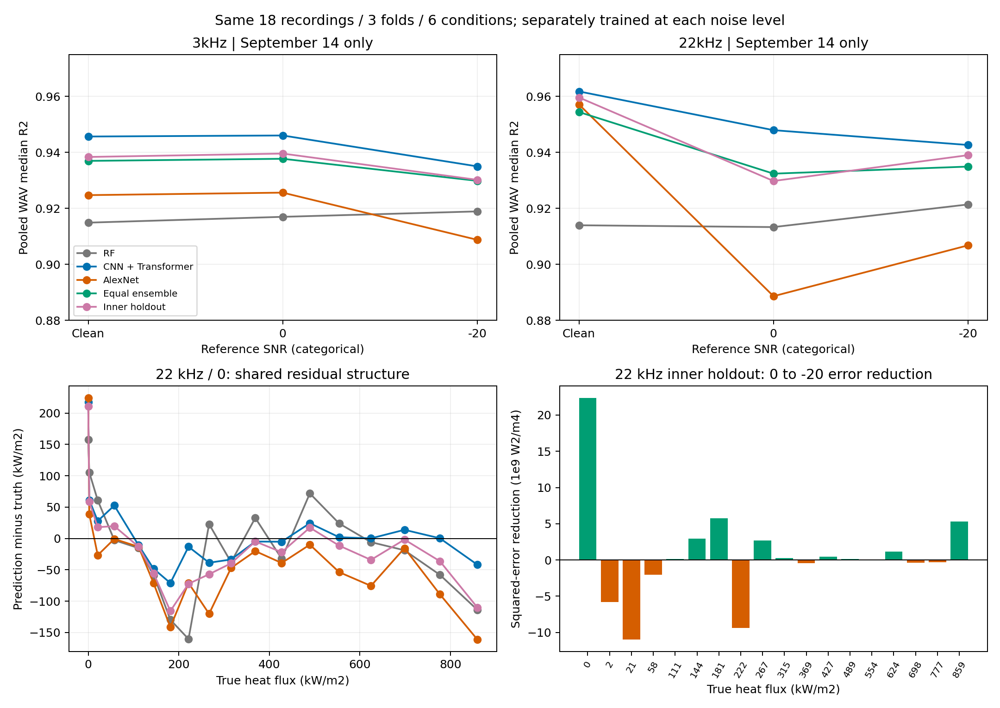

# 9/14の結果に限定した、学部との差とアンサンブル悪化の原因分析

解析日: 2026-09-16。本人の最新指定に従い、**2025.06.11の20260914_selected_log_architectureだけ**を解析した。9/15実行の性能・説明性は本解析に混ぜていない。学習・元結果・モデル実装は変更していない。

## 1. 結論と確かさ

最も直接的な説明は、**現行3モデルの精度差に対して誤差の相殺が不足し、CNN＋Transformerの良い予測をRF・AlexNetが同じ誤差方向へ動かしていること**。保存された予測から確認できる。強ノイズでは相殺もあるが、追加される誤差を上回らない。

その上流には、(a) 元WAV分離による未学習の熱流束・録音への予測、(b) 少数WAVから決める統合重み、(c) モデル・入力・ノイズ生成仕様の変更、がある。**データ年の違いだけを原因とする根拠はない**。ただし各変更の寄与率、気泡音と装置音の寄与、各モデルの特徴抽出の因果関係は未確定である。

本人の「2024データを現行機構で処理しても修士の結果に近づくのでは」という予想は、評価・前処理・モデルの変更が大きい点で筋が通っている。ただし未実行の仮説であり、同じ曲線や順位になるとはまだ言えない。

## 2. 固定した対象と検算

- 3/22 kHz × 無雑音・reference SNR 0・−20、計6条件。run hash `a85021`、instance `121640`。
- 同じ18 WAV × 60 chunks = 1,080 chunks。1秒chunk、元WAV分離3-fold。元WAV ID・chunk・真値・foldが6条件で一致することを照合した。
- **この実行の学習対象は06.11だけ**。研究全体には2025年3実験があるが、3実験を混ぜて学習した今回のモデルではない。保存manifestの `experiment_names` も1日だけ。
- 各ノイズで別学習、300 epochs設定、seed 42。固定モデルへノイズだけを増やした転送評価ではない。
- 主値はchunkを統合→元WAV内中央値→全18 WAVをpoolしたR²。全5方式の保存WAV予測をchunkから再構成して照合した。
- 元runに残る `prediction_max` は今回の主比較から除外。これは現行2方式と異なる履歴方式である。
- 数値検算・入力出典hashは [verification.json](verification.json)、再現コードは [analyze.py](analyze.py)。説明性CSVは9/14だけを採取した既存スナップショットを使用。

## 3. まず曲線を三つの問いに分ける

| 上限 | ノイズ | RF | CNN＋Transformer | AlexNet | 単純平均 | inner holdout |
|---|---|---:|---:|---:|---:|---:|
| 3 kHz | 無雑音 | .91488 | .94566 | .92471 | .93695 | .93835 |
| 3 kHz | 0 | .91696 | .94603 | .92560 | .93770 | .93957 |
| 3 kHz | −20 | .91889 | .93499 | .90874 | .92981 | .93018 |
| 22 kHz | 無雑音 | .91394 | .96177 | .95712 | .95441 | .95962 |
| 22 kHz | 0 | .91329 | .94793 | .88859 | .93239 | .92976 |
| 22 kHz | −20 | .92138 | .94263 | .90676 | .93491 | .93899 |

1. **ノイズで低下するか**: CNNは無雑音→−20で両帯域とも低下する。RFはほぼ横ばい、AlexNetの22 kHzは0で大きく落ち、−20で一部回復する。
2. **統合は最良単体を上回るか**: 現行2統合方式は6条件すべてでCNNを下回る。ただしRF・AlexNetの一方または両方より良く、統合が全単体に負けるわけではない。
3. **統合は低下幅を抑えるか**: 3 kHzの無雑音→−20のR²低下はCNN .01067、単純平均 .00714、inner .00817。小さい低下幅と最良単体を超えることは別。22 kHzではCNN .01915、単純平均 .01951、inner .02063で、統合の低下幅も小さくない。

chunkを全foldでpoolしたR²でも両統合は6条件でCNNを下回る。したがってWAV中央値への変更だけでこの順位差は説明できない。ただし卒論の表示はchunkのfold平均であり、pooled値と同一指標として数値差を解釈しない。3点だけなので、未観測の−4〜−16における曲線の形は議論しない。[metrics.csv](metrics.csv)

## 4. 学部から変わったものはデータだけではない

卒論本文の保存抽出（§3.2、3.6、3.7）と数表、既存の旧コード監査、今回の保存manifestを照合した。学部の原本PDFを今回新規に再抽出したものではない。

| 要素 | 学部 | 9/14 |
|---|---|---|
| 元データ | `2024.11.12_1_2.13_1`。卒論本文では3実験をまとめて学習 | 06.11の1日、18 WAV |
| 単体 | AlexNet / ResNet50 / VGG16 | RF（XGBRF＋PCA）/ CNN＋Transformer / AlexNet |
| 入力 | 振幅スペクトログラム、各chunkのmin–max | 絶対power保持、深層は `log1p(power/1e-12)` |
| chunk | 0.5秒 | 1秒 |
| 分割 | 旧監査では通常のchunk単位5-fold | 元WAV分離3-fold、各foldは学習12 WAV・評価6 WAV |
| ノイズ | 元信号パワーに応じて倍率を決定 | 固定global RMSのreference SNR、paired noise |
| 重み | 評価に使う検証データのR²から決定 | 外側評価と別のinner holdout、または等重み |
| ONB | 3実験のONB熱流束の平均 | 当該日のONB測定点368,978.105 W/m² |
| AUC | 二値予測から算出 | 二値AUCと連続ROC-AUCを区別 |

学部の無雑音R²は単体約.9974〜.9975、統合.9986。比較的似た精度の3モデルを統合していた。現行22 kHz無雑音ではCNN .9618に対しRF .9139であり、同じ「3モデルの統合」でも出発点が異なる。

通常のchunk分割では同じ録音の他区間が学習に入り得る。現在は録音全体を除くため、録音固有の特徴を使った補間と、未見録音への推定の違いが出る。さらに旧方式は評価正解を重み決定にも使っている。旧値がどれだけ高くなったかは対照計算なしには決められないが、独立した外側評価とは条件が違う。

旧min–maxは入力全体の倍率を除くのに対し、現行は音量情報を残す。したがってノイズで周波数形状が崩れても使える情報が違う。旧相対SNRと現行reference SNRは同じ「−20」の数字でも同じ実現SNRではない。

8/17の「元信号パワーが注入ノイズへコピーされる」という原因は旧相対RMS版に対する診断で、**修正済みの9/14データの原因へそのまま適用しない**。今回の曲線からショートカット再発とは判定しない。

出典: [卒論本文の既存抽出](../2026-09-15_onb_frequency_comparison/thesis_extracted_text.txt)、[卒論数表](../2026-09-15_onb_frequency_comparison/comparison/thesis_table_values.csv)、[旧版と生成式の監査](../../docs/research_plan/2026-08-17_noise_accuracy_reversal_investigation.md)。これらの資料内にある9/15性能は本解析の数値には使用していない。

## 5. 統合が悪化する直接の機構

### 5.1 違うモデルでも、間違い方が似ている

18 WAVの残差（予測−真値）の相関は、CNN–AlexNetで **.883〜.935**、RF–CNNで **.750〜.911**。これは予測値同士の相関ではなく、誤差同士の相関である。異なるアーキテクチャでも、相殺に有利な違いが十分あるとは限らない。[residual_pairs.csv](residual_pairs.csv)

22 kHz・0の具体例（kW/m²）:

| 真値 | RF | CNN | AlexNet | inner統合 | 解釈 |
|---:|---:|---:|---:|---:|---|
| 181.4 | 51.9 | 110.4 | 40.0 | 65.7 | 全モデルが過小。統合がCNNをさらに下げる |
| 221.5 | 61.2 | 208.4 | 150.6 | 149.3 | CNNが近いが、他モデルで低下する |
| 859.3 | 745.7 | 817.6 | 698.4 | 749.4 | 高熱流束を全モデルが過小推定する |

同条件のAlexNetの平均残差は−38.4 kW/m²、CNNは+7.4 kW/m²。全体平均の符号は反対でも、録音ごとの大きな誤りは同方向になり得る。平均biasだけを見て「相殺する」と予測するのも不十分。

### 5.2 相殺があっても、追加誤差の方が大きい

CNNの誤差を e、統合によってCNNの予測から動いた量を d とすると、各WAVで厳密に

`(e+d)^2 − e^2 = 2ed + d^2`

が成り立つ。`2E[ed]` が負なら平均的な誤差打ち消しがある。しかし `E[d²]` より十分大きな打ち消しが必要である。これは説明用に導いた恒等式であり、論文から引用した式ではない。

真値分散で割ったinner統合の分解:

| 条件 | 誤差と移動の交差項 | 移動量の二乗 | 合計＝CNNに対するR²損失 |
|---|---:|---:|---:|
| 3 kHz・−20 | −.00191 | +.00673 | +.00481 |
| 22 kHz・−20 | −.00265 | +.00629 | +.00364 |
| 22 kHz・0 | +.00653 | +.01164 | +.01817 |

強ノイズ2条件では補完があるが、統合による余分な動きが大きい。22 kHz・0では交差項自体も悪化方向である。実際の「chunk統合後のWAV中央値」を使って分解しており、中央値の平均で代用していない。[ensemble_decomposition.csv](ensemble_decomposition.csv)

### 5.3 inner重みが外側での適否を十分に表していない

22 kHz・0・fold2では、外側WAV R²がCNN .9788、AlexNet .8732。それでも保存重みはCNN **.334**、AlexNet **.428**、RF .238。CNNの精度差を生かせず、統合は.9287へ下がった。

保存設定と現行の対応実装から、外側学習12 WAVの20%に当たる**3 WAV**がinner評価、残り9 WAVが重み算出用モデルの学習となる。その誤差に基づく逆数重みを、本体モデルへ移している。3録音での成績が外側6録音での順位を代表しない可能性がある。重み算出用モデルと本体モデルの学習量も異なる。

これは保存重みと外側成績の不一致という事実を説明する候補であり、「3 WAVの少なさが唯一の原因」と確定したわけではない。innerの当時の予測・split監査ファイルは今回確認したrunにはないため、実現したinner誤差の再検証まではしていない。

また、個別誤差の逆数で重みを決める方式は、モデル間の誤差の共変動を直接最適化していない。単体の成績が良いことと、加えると既存モデルを改善することは別である。[weights.csv](weights.csv)、[fold_metrics.csv](fold_metrics.csv)

### 5.4 RFを抜くだけで一律に解決するわけでもない

保存chunk予測を事後的に2モデル平均すると、22 kHz無雑音のCNN＋AlexNetはR² **.96309**となり、CNN .96177をわずかに上回る。一方22 kHz・0では同じ2モデル平均が **.92837**へ下がる。強ノイズ時にはRF＋CNNの方がこの2モデル平均より良い。

つまりRFが常に悪いのでも、AlexNetが常に不要なのでもない。条件により補完に使えるモデルが変わる。これは原因診断用の事後比較であり、外側評価を見て選んだ組合せを検証済みの手法として採用してはいけない。[posthoc_pair_diagnostics.csv](posthoc_pair_diagnostics.csv)

## 6. なぜ各モデルの誤差が揃うのか

### 6.1 元WAV分離では熱流束の端が学習範囲外になる

今回のfold2は真値859.3 kW/m²を評価に含むが、学習側の最大は776.6 kW/m²。fold3はほぼ0と2.36 kW/m²を評価に含むが、学習側の最小は20.98 kW/m²。**極値の予測には学習した熱流束範囲の外への推定が必要**である。[outer_training_ranges.csv](outer_training_ranges.csv)

全条件の予測対真値の回帰傾きは単体で約.826〜.932で、低い真値を高め、高い真値を低めに予測する圧縮傾向と整合する。特にRFの高端予測は約744〜746 kW/m²でほぼ一定。モデル固有の小さいノイズ変動だけでなく、学習範囲・共通の難しいWAVが誤差を支配している可能性が高い。

ただし全誤差が端点由来ではない。181/222 kW/m²にも大きな過小推定がある。これらは範囲内なので、録音の音響特性・ラベル対応・中間領域の学習密度を別途調べる必要がある。「外挿だから全部説明できる」とはしない。

### 6.2 非単調な回復は一様な改善ではない

22 kHz・0→−20でinner R²は.92976→.93899へ回復する。しかしほぼ無加熱の1 WAV（`index=1.3.28E-04`、真値0.000328 W/m²）で予測が **211.1→148.9 kW/m²**へ下がった分は、全体の二乗誤差減少の **187.6%**に相当する。他17 WAVの合計では誤差が増え、これを部分的に相殺しているという意味である。

同じ1 WAVはAlexNetの二乗誤差減少の82.3%、RFの61.2%に相当する。CNNはこのWAVでは改善するが、他の悪化が大きく全体では低下する。したがって「強いノイズが全域の識別を良くした」とは読めない。

この1本を主評価から削除する提案ではない。有限標本・再学習・特定録音への誤差の集中を診断した結果である。次はこのWAVと悪化した21/222 kW/m²の入力を対で見る必要がある。[recovery_by_wav.csv](recovery_by_wav.csv)、[endpoint_sensitivity.csv](endpoint_sensitivity.csv)

## 7. 各モデルは何を見ていると考えられるか

全検証集合のゼロ置換マスクを、同じ条件の3-foldで平均した「最大R²低下帯域」は以下。帯域の重要度を確定する表ではなく、現モデルの入力変更への感度である。

| モデル・入力 | 無雑音 | 0 | −20 |
|---|---|---|---|
| RF・3 kHz | 2–3 kHz (.461) | 2–3 kHz (.442) | 2–3 kHz (.468) |
| CNN・3 kHz | 1–2 kHz (1.230) | 1–2 kHz (1.632) | 1–2 kHz (1.783) |
| AlexNet・3 kHz | 1–2 kHz (17.785) | 2–3 kHz (11.512) | 2–3 kHz (37.806) |
| RF・22 kHz | 2–5 kHz (.442) | 2–5 kHz (.428) | 2–5 kHz (.448) |
| CNN・22 kHz | 15–22 kHz (2.037) | 2–5 kHz (1.671) | 512–1000 Hz (2.021) |
| AlexNet・22 kHz | 1–2 kHz (8.519) | 1–2 kHz (31.026) | 1–2 kHz (129.438) |

括弧はfold内WAV R²の低下の3-fold平均。主表のpooled R²からこの値を引くことはできない。帯域幅も一定ではないため、単位Hz当たりの重要度ではない。[mask_means.csv](mask_means.csv)

**RF**は線形powerをflatten→PCA100成分→深さ4のXGBRF300本で予測する。3 kHzで2–3、22 kHzで2–5が全9 fold条件ずつで最大で、一貫性がある。時間1/4のマスク応答は小さい。現時点では「特定の瞬間より、低kHz帯の分布・強度に安定して依存する」と読むのが妥当。ただしPCA成分は多数の画素の混合であり、TreeSHAPで直接2.2 kHzの気泡音を同定したわけではない。

**CNN＋Transformer**はlog-power→CNN→7個の時間token→Transformer2層→時間平均→熱流束の構造。6条件で最良なので、現データの未見WAVに有効な特徴を最もよく取り出している。ただし「Transformerが気泡発生順序を理解した」ことは示されていない。3 kHzでは1–2 kHzのマスク感度が大きく、22 kHzではノイズ条件ごとに最大帯域が変わる。別々の再学習モデルが異なる入力手がかりへ適合した可能性と、ゼロ置換で不自然な入力になった影響を分ける必要がある。

**AlexNet**はlog-power→CNN→Flatten→4096次元全結合2層。22 kHzの0で大きく悪化し、平均的に過小推定する。周波数だけでなく時間1/4のマスクでも、22 kHz・−20の平均R²低下が166.54に達する。これは単に「1–2 kHzが極めて有用」ではなく、入力の一部をゼロにしたとき出力が大きく破綻するモデルであることを示す。入力の絶対配置・背景レベル・特徴の組合せへの依存が候補だが、大きい全結合部やBatchNormなど、どの部位が原因かは未検証。

帯域上限の変更も情報の追加だけではない。どちらも224列へresizeするため、概算の画像列幅は3 kHzで13.4 Hz、22 kHzで98.2 Hzとなり、低kHzの模様が占める列数も約7.3倍違う。さらにRFは線形power、深層はlog圧縮なので、小さいpowerの背景成分の相対的な見え方も違う。周波数依存差の有力候補だが、本解析では帯域内SNRを新規計測しておらず、特定帯域を「ノイズに埋もれていない」と定量的に断定しない。

## 8. 説明性の信頼性と物理解釈の境界

9/14のIGは180例中179例でcompleteness相対誤差が0.05を超える。モデル・帯域別の中央値は約972〜2491で、わずかな丸め誤差ではない。ゼロbaselineから出力差までを寄与の合計で説明するはずの計算が整合していない。[ig_quality.csv](ig_quality.csv)

現行実装は生power上のゼロbaseline、等間隔64分割の台形積分で、モデル内部に `log1p(p/1e-12)` がある。この変換の傾きは正のpで `1/(1e-12+p)` となり、ゼロ近傍で急に大きくなる。積分経路のゼロ近傍を粗く刻むことは大きな数値誤差の具体的候補。ただしモデル全体での積分点数・baseline・経路を変えた収束試験をしていないため、原因確定ではない。

22 kHz無雑音ONB代表画像では、入力の約2–3 kHzの強い成分と両IGの明るい部分が重なることを目視確認した。しかし誤った積分でも入力振幅に似た模様が出る可能性があり、「両モデルが同じ気泡を見た」とは結論しない。画像ごとの正規化色なのでモデル間の寄与量も比較しない。Grad-CAMも粗い局在の補助であり、この問題の検算の代わりにはならない。

RFのTreeSHAPは既存9/14スナップショットで再構成誤差中央値約0.226 W/m²と良好。ただしPCA空間の説明である。マスクは予測が変わることの証拠にはなるが、ゼロという未学習入力への反応も含む。安定性や最終層ランダム化は別の性質を調べるもので、IGの数値不一致や気泡起源を解決しない。

現時点の説明可能範囲は **「どの入力変更に依存するか」「どの録音でどの方向に誤り、統合でどう動くか」**。音響特徴の物理起源・因果機構には、同期観測や条件を揃えた入力介入が別に必要である。

## 9. ONBにも同じ統合問題が現れる

3 kHz・−20、真値ONBは368.98 kW/m²。CNNは377.14で検知するが、RF361.58、AlexNet352.44が下げ、単純平均366.11、inner367.03となり両統合は見逃す。回帰R²が良いことと、閾値直上の録音を検知することは一致しない。

22 kHz・0では逆にRF401.80がCNN364.10を押し上げ、単純平均371.02はONBを拾うが、inner364.21は拾わない。RFの上振れが検知に役立つ例もある。目的を全域MSEとするかONB近傍誤りとするかで統合の評価が変わる。

## 10. 原因を識別する次の比較

学習を大量に増やす前に、次の比較の目的を分ける。以下は提案で、実行済みではない。

| 順序 | 比較 | 何が分かるか／判定 |
|---|---|---|
| 1 | 同じ2025・同じ分割・代表3ノイズで複数seed。0、21、181、222、859 kW/m²の残差を個別保存 | 0の谷や−20の回復がseed間変動内なら、安定した物理効果とは扱わない。共通の過小/過大推定が持続するかを見る |
| 2 | **2024データを現行生成・モデル・元WAV分離評価で再実行**。可能なら日別評価と3日混合を分ける | 本人の仮説を直接調べる。現行の傾向へ近づけば処理・評価変更の説明を支持。ただしこれだけで処理のどの変更かは確定しない |
| 3 | 2024/2025 × 旧/現行処理を段階的に比較。最初に分割だけ、次に入力正規化・ノイズ生成を別々に変更 | 年と処理の主効果・相互作用を分ける。旧通常KFold・外側正解重みは歴史再現専用で、主張用評価にしない |
| 4 | cleanで学習したモデル・PCA・scaler・重みを固定し同じWAVのノイズ版へ適用 | matchedの再適合と、固定モデルの未知ノイズ耐性を区別する |
| 5 | 元WAV分離inner OOFで統合／組合せを学習側だけで決定し同じ外側で評価 | 少数holdoutと共通誤差を考慮しない重みがどれだけ影響したか。9/16の新方式は実装済みだが本性能未検証 |
| 6 | IGを少数例で収束確認、マスクをゼロ・学習側背景値・matched noiseで比較、必要なら共通Hz gridで保持/除去し再学習 | マスク破綻・入力解像度・実際の帯域情報を切り分ける |

2024への現行適用だけで卒論の曲線が復元しなくても「2024データに価値がない」「学部の成果が間違い」とはならない。何を学習・評価していたかの差を同定する比較である。また2024・2025でラベル分散や範囲が違えばR²の比較も変わるため、RMSE、ONB近傍誤り、学習範囲外のWAVを併記する。

今回確認できたのは、**9/14における統合悪化の予測レベルの機構と、非単調な回復を支配する録音**である。上流の原因は、学部との差を一つずつ固定した比較で検証する。

## 保存物

`metrics.csv`（chunk pooled/WAV pooled）、`fold_metrics.csv`、`wav_predictions.csv`、`weights.csv`、`residual_pairs.csv`、`ensemble_decomposition.csv`、`posthoc_pair_diagnostics.csv`、`recovery_by_wav.csv`、`endpoint_sensitivity.csv`、`outer_training_ranges.csv`、`mask_means.csv`、`mask_top_per_fold.csv`、`ig_quality.csv`、`verification.json`、[図PNG](cause_overview.png) / [PDF](cause_overview.pdf)。すべて9/14限定。性能差の統計的有意性は検証していない。
