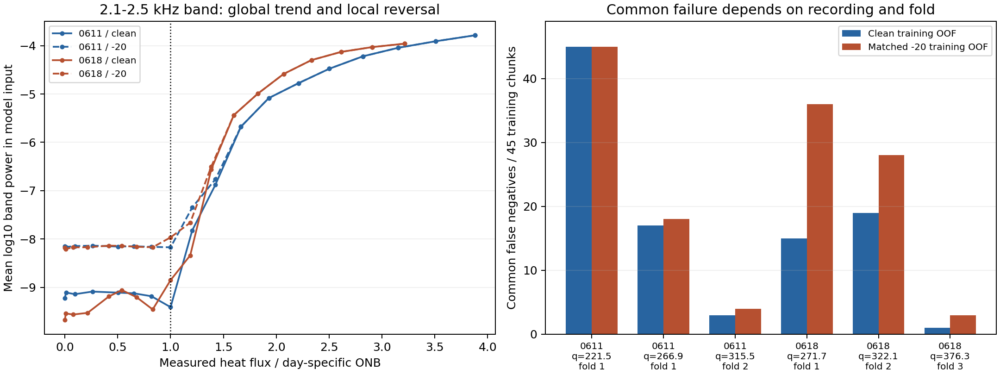
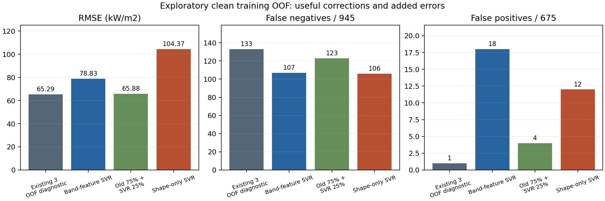

# 学習OOFの共通失敗と帯域特徴SVRの予備比較

解析日：2026-10-04。本人の「次へ進める」という指示により、[前段の課題整理](../../docs/research_plan/2026-10-04_current_challenges_xai_and_model_diversity.md)の第2段階を実施し、候補を一つのモデル系列へ絞ったうえで小規模な学習側予備比較まで進めた。

結論は、追加モデルによる訂正余地は実際にあるが、今回の帯域特徴SVRは採用を見送る、である。cleanの既存3モデルの共通見逃し100件中8件を単体で訂正した一方、誤報とONBちょうどの回帰誤差を増やし、未学習noiseへの転送も崩れた。絶対パワーを外す一つの対照でも改善しなかった。これはSVR一般や追加モデル案の否定ではなく、今回の特徴・候補・条件についての判断である。

現在の共通失敗には、弱い音響区間と、内部foldのONB録音配置が関わる可能性がある。次にモデルを多数追加する前に、同じ外側分割・採用値で内部配置だけを変える識別比較を行う価値がある。その対照分割は作成・監査済みだが、既存3モデルの再学習は未実施。

## 1 目的と実施状態

今回の問いは、既存モデルの共通失敗を減らす候補には何が必要か、その候補を加えるだけで有用な補完が得られるか、である。本人の仮説である「違う予測傾向のモデルを加える」を、訂正と追加誤りの両方から調べた。

| 作業 | 実施した範囲 | 状態 |
|---|---|---|
| OOF残差診断 | cleanとnoise別matchedの7種類、各1620 chunk | 出力・解析済み |
| 入力特徴診断 | 学習側のcleanと−20 dB、各1620 chunk | 出力・解析済み |
| 帯域特徴SVR | clean内のnested WAV分離CV、Cは3候補 | 学習・保存・解析済み |
| 絶対パワー除去対照 | 同じSVRの5特徴版、同じnested CV | 学習・保存・解析済み |
| 固定平均の診断 | 4モデル等重み、旧統合75%＋SVR25% | 保存OOF上で算出済み、新重みのfitなし |
| 内部ONB配置の対照 | 2録音のfoldを交換し、学習側にONB録音を残す | 分割作成・監査済み、モデル再学習は未実施 |
| 最新既存3モデルのXAI | 学習済み状態が保存されていない | 計算していない |
| 外側540 chunkでの新候補評価 | 今回の候補学習・比較へ使用しない | 未実施 |

主コード、現行matched設定、原データ、既存runは変更していない。今回保存したSVRのfoldモデルはこの予備比較用であり、最新runのRF・Conformer・AlexNetを保存・復元したものではない。対象外の日、帯域、入力長、過去runを新しく解析へ追加していない。

## 2 対象と再現条件

既存runの出典は[10/3対応解析のscope](../2026-10-03_tuned_within_wav_matched_comparison/run_scope.json)。clean_onlyは10/1の採用値run、matchedは10/3の対応runである。共通条件は3 kHz、1秒、6/11＋6/18統合、選別なし、seed 42、150 epochs、学習側WAV3-fold。既存モデルの採用値とデータの条件は変更していない。

外側学習1620 chunkは36 WAVの各45秒、外側テスト540 chunkは各15秒。今回の数値は前者のOOFに基づく。ONB判定は日別221.505／271.678 kW/m²で行い、学習側ONB前は675、ONB以上は945 chunk。ONB〜1.5倍は270 chunk・6 WAV、近傍±10%は90 chunk・2 WAV。

clean_onlyの学習OOFは各noiseの保存先で同じclean fitを参照するので一度だけ読む。matchedは0／−4／−8／−12／−16／−20 dBの6 fitを読む。matchedの無雑音OOFはclean_onlyと完全一致した。7種類のOOFは元WAV、chunk、真値、内部fold配置が一致し、内部fit／held-out間のWAV共有は0だった。

外側テストはsplit indicesと入力manifestのIDだけを読み、1620学習chunkから除外したことを監査した。外側の予測と入力配列は読んでいない。入力配列はcleanと−20 dBの学習chunkを1件ずつ読み、計3240配列から特徴を算出した。[条件記録](../../configs/experiments/2026-10-04_training_oof_diversity_diagnosis.json)、[監査と元OOFのSHA-256](input_audit.json)。

7×1620件を独立した11340標本とは数えない。同じ元WAV・chunkがnoise間で対応し、36録音も2実験日の段階に由来する。今回のfold差は学習seed差や新しい実験の不確かさを示す量ではない。

## 3 学習側にも共通失敗が存在する

[共通失敗](oof_common_failures.csv)、[モデル・領域・日・fold別指標](oof_metrics.csv)、[残差積と相関](oof_residual_pairs.csv)。以下の統合値は保存OOFの単体誤差から既存定義の重みを再構成した診断値である。

| ONB〜1.5倍の270 chunk | 全3モデルが真値より低い | 全3モデル陰性 | 既存統合のFN | FN中に陽性モデルあり |
|---|---:|---:|---:|---:|
| clean | 160 | 100 | 133 | 33 |
| matched 0 dB | 170 | 109 | 134 | 25 |
| matched −4 dB | 169 | 116 | 134 | 18 |
| matched −8 dB | 173 | 124 | 141 | 17 |
| matched −12 dB | 183 | 122 | 138 | 16 |
| matched −16 dB | 177 | 131 | 141 | 10 |
| matched −20 dB | 167 | 134 | 144 | 10 |

cleanでも統合FN133件中100件、約75%は既存予測の非負平均で救えない。一方、60 kW/m²未満の360 chunkでは285件が全モデル過大予測だった。ONB直後を一律に上方補正すると、低側の共通過大予測を悪化させる可能性がある。

common FNにおける「最大単体予測がONBへ届かない量」の中央値はclean 48.72、matched −20 dB 102.23 kW/m²だった。小さな閾値ずれだけで全共通失敗が生じたとは言えない。正解を知る凸結合の仮想下限RMSEも、ONB〜1.5倍でclean 61.56、matched −20 dB 95.56 kW/m²であり、既存3予測の範囲が持つ制約は学習側にもある。

残差相関はcleanのConformer／AlexNetで0.833、matched −20 dBでは全3組が約0.80〜0.82だった。相関だけでなく共通biasと残差積も正である。これらは多様性の不足を診断する根拠であり、新しい統合方式の効果を測った結果ではない。

## 4 ONB録音と内部fold配置を分けて考える

[WAV別誤差](oof_wav_profiles.csv)、[内部学習側の熱流束段階](inner_target_support.csv)。

| 日と実熱流束 kW/m² | OOF fold | clean共通FN／45 | 内部fitにある近傍±10%のWAV |
|---|---:|---:|---:|
| 6/11 ONB 221.51 | 1 | 45 | 0 |
| 6/11 266.91 | 1 | 17 | 0 |
| 6/11 315.47 | 2 | 3 | 2 |
| 6/18 ONB 271.68 | 1 | 15 | 0 |
| 6/18 322.11 | 2 | 19 | 2 |
| 6/18 376.32 | 3 | 1 | 2 |

両日のONBちょうどの録音が同じfold1へheld-outとして入り、そのfitには近傍録音がない。ONB付近のfitラベルは184.19と315.47 kW/m²の間が空いている。共通FN100件中60件はONBちょうど、77件はこのfold1の3録音に集中した。

**確認事実**はONB録音の配置と誤りの集中である。**原因仮説**は、その配置と、ONB付近の音響特性を学習側で十分に見る機会の不足が、OOFの過小予測へ影響した可能性。fold2にも共通FNが22件あるので、配置だけで全問題が説明できるわけではない。

WAVを分けたことはリーク防止の意図した設計であり、今回の発見からchunk混在へ戻さない。また、OOFの内部fitは24 WAV・1080 chunk、最終fitは36 WAV・1620 chunkを使うため、OOF件数と既存の外側23／45件等を同じ難しさの比率として比較しない。内部配置が重み選択へ影響するかを調べることは、未知WAV評価を新しい外側必須runにすることとは別である。

## 5 入力の帯域特徴が示すこと

現行NPYは線形パワーの224×224配列で、軸は時間、周波数。既存マスクと同じ`round(224 × Hz / 3000)`で帯域を区切った。resize後の座標による近似帯域であり、元波形の厳密な帯域積分や校正済みPSDとして数値を読まない。

固定した特徴は、0.512–1、1–2、2–3、2.1–2.5 kHzと全体のlog10平均power、2–3／1–2と2.1–2.5／1–2のlog比、スペクトル重心、正規化entropy、全帯域powerの1秒内変動係数の計10個。元WAV名、日、chunk番号、真値、noisy入力に対応するclean信号power等をモデル入力に使わない。[chunk特徴](training_input_features.csv)、[WAV平均と標準偏差](training_wav_features.csv)。

### 全域の相関とONB直前の区別は一致しない

2.1–2.5 kHzのWAV平均log-powerと熱流束のSpearman相関はclean 0.924、−20 dB 0.920だった。しかし、6/11の直前段階181.38とONB 221.51では、cleanの平均log-powerが−9.183から−9.408へ下がる。ONBの方が常に強い音、という規則はここで成立しない。

同日のこの2録音だけを比べた記述的な順位AUCは、2.1–2.5 kHz powerでclean 0.000、−20 dB 0.458、全powerで−20 dB 0.486だった。対して6/18ではcleanの帯域power AUCが0.791、帯域比が0.807だった。日によって近傍の特徴変化も異なる。[直前段階との特徴対照](adjacent_onb_feature_contrasts.csv)。

これらのAUCは特徴を高い側から並べた同一録音内chunkの記述量であり、独立したONB分類器の検証成績ではない。高熱流束の強い特徴が全域の高い相関を作っていても、低〜ONB近傍の区別がnoiseで弱くなることは両立する。

### 同じ録音内でも弱い区間へ共通失敗が集まる

共通FNとそれ以外が混在する5つのONB近傍録音では、共通FN側の帯域power、帯域比、時間変動係数は低かった。例えば6/11の266.91 kW/m²では、共通FN17秒の2.1–2.5 kHz平均log-powerは−9.344、それ以外28秒は−6.894だった。[同一WAV内の特徴差](within_wav_common_fn_features.csv)。

これは、弱い音響区間とモデルの共通低予測が対応する事実である。弱い区間のラベルが間違っている、気泡が存在しない、またはこの帯域が必ず気泡音である、という証拠ではない。熱流束ラベルは録音の測定段階に付いており、秒ごとの気泡イベント正解ではない。

また、入力特徴の差はモデルがその特徴を使った証拠と同一ではない。最新runは`save_fitted_artifacts=false`で、学習済みモデルがなく、今回はそのIG・TreeSHAP・固定モデルの帯域マスクを新たに計算していない。



## 6 帯域特徴SVRを一つの候補として試した理由

既存の共通失敗が弱い帯域power・比率・時間変動に対応し、一つの絶対power閾値では日別ONBを区別できなかったことから、明示した複数特徴と非線形な学習規則を組み合わせる小規模候補を選んだ。PCAを経由せず、木・CNN系とは異なるRBF SVRを使う。これは特徴表現とモデル系列の両方を変える比較であり、アーキテクチャだけの因果効果を分離するものではない。

SVRのkernel・C・epsilonの意味は[公式仕様](https://scikit-learn.org/stable/modules/generated/sklearn.svm.SVR.html)、前処理・正則化を含む線形対照の性質は[Ridge公式仕様](https://scikit-learn.org/stable/modules/generated/sklearn.linear_model.Ridge.html)で確認した。Ridgeを実測比較して劣位と判定したわけではない。今回は単一powerの単調性が崩れる例を含む複数特徴の候補を、計算量の小さいSVR一系列に絞った。

学習は既存モデルと同じ3つのWAV分離OOF fold。各foldのfit24 WAVだけで、さらに3つのWAV分離CVを作り、C=1／10／100をcleanのRMSEで選んだ。StandardScalerとtargetのMinMaxScalerはその都度fit側だけで学習。epsilon=.02、gamma=scaleを固定し、選択したCで1080 chunkをfitしてheld-out540 chunkを予測した。

最初の候補のCはfold1／2／3で10／1／1。−20 dBは各clean fitの同じheld-out chunkへ転送しただけで、Cの選択には使っていない。元WAV分離、前処理のfit範囲、予測再読込を監査した。[設定](../../configs/experiments/2026-10-04_band_feature_svr_training_pilot.json)、[foldとモデル保存の監査](svr_pilot_audit.json)、[内側C選択](svr_inner_parameter_selection.csv)。

ただし特徴系列自体は今回の学習側診断を見て決めているため、研究設計全体が完全未参照のnested検証になったとは言わない。新候補の探索的予備評価として扱う。

## 7 cleanの訂正と追加誤り

以下は1620学習chunkのOOF診断。FNの母数945、FPの母数675、RMSE単位kW/m²。既存3統合は、このOOF自身から計算した重みを使うため、独立に検証した新統合器の成績ではない。

| 方法 | 全域RMSE | 近傍±10% RMSE | FN | FP | 既存共通FN100件の訂正 |
|---|---:|---:|---:|---:|---:|
| 既存3モデルperformance診断 | 65.29 | 68.35 | 133 | 1 | 0 |
| 10特徴SVR単体 | 78.83 | 132.10 | 107 | 18 | 8 |
| 4モデル等重み | 67.29 | 88.68 | 124 | 4 | 0 |
| 旧統合75%＋SVR25% | 65.88 | 80.95 | 123 | 4 | 0 |
| 5特徴SVR単体 | 104.37 | 131.42 | 106 | 12 | 9 |

10特徴SVR単体は既存統合の二値誤りを30件訂正し、21件追加した。追加の内訳はFP17、FN4である。共通FNの訂正8件は、6/11の315.47で1件、6/18の271.68で3件、322.11で4件。中心的な6/11 ONBの共通FN45件は救えず、平均予測も67.36 kW/m²と大きく低かった。

旧統合75%＋SVR25%は11訂正／4追加、MAEは50.39から49.07へ改善した。しかし全域RMSEは65.29から65.88、近傍RMSEは68.35から80.95へ悪化し、共通FNは救えなかった。見逃し総数の減少は、主に元から補完可能だった標本で生じた。4等重みも共通FNを救えず、新モデルが陽性でも平均で薄まるという前段の懸念が実際の保存予測で確認された。

SVRとConformerのONB〜1.5倍残差相関は0.604で、既存Conformer／AlexNetの0.833より低い。それでも近傍誤差が増えているため、相関が低いことだけを採用基準にできない。R²、MAE、bias、Precision、Recall、F1、近傍誤差、ROC／PR-AUCも[全指標](svr_full_metrics.csv)に保存した。AUCの連続scoreは日別ONBからの予測marginであり、平均ONBを使う通常runのAUCと無条件に比較しない。[訂正と追加](svr_error_corrections.csv)、[残差組合せ](svr_residual_pairs.csv)。



## 8 noise転送と絶対パワー除去の対照

clean fitしたSVRを学習側held-outの−20 dB入力へ転送した結果。

| SVRの特徴 | 全域RMSE kW/m² | FP／675 | FPR | FN／945 |
|---|---:|---:|---:|---:|
| 絶対powerを含む10特徴 | 154.76 | 365 | 54.07% | 157 |
| 絶対powerを外した5特徴 | 176.58 | 368 | 54.52% | 150 |

絶対powerにnoiseが加わると入力のレベルが動くため、その依存が誤報の主因かを調べる目的で5特徴版を追加した。除いたのは5つのlog絶対powerだけで、帯域比、重心、entropy、時間変動を残した。同じC候補・epsilon・gamma規則を使い、Cはcleanのnested CVで10／10／1を選んだ。[対照条件](../../configs/experiments/2026-10-04_band_shape_svr_training_ablation.json)、[全指標](svr_shape_full_metrics.csv)。

絶対powerを除いても誤報は減らず、cleanのRMSEも悪化した。したがって「絶対power特徴を除けば今回の転送問題は解ける」という見通しは支持されない。比率等も加算noiseで変わり、入力の識別性が弱まる可能性がある。Cや特徴数に応じた実際のgammaも変わるので、この比較だけで個々の特徴の因果寄与を完全分離したとは言わない。

この対照はnoisy学習側結果を見て設計したものであり、noiseに関する情報を設計へ全く使わない試験とは区別する。候補モデル自体のfitとC選択にはcleanしか使用していない。

既存cleanモデルのnoise条件OOF予測は学習済み状態なしでは再計算できないため、SVRのnoise転送をmatched-trained OOFと混ぜて4モデルclean_only統合にしない。今回のnoise表はSVR単体の転送診断であり、外側の既存統合RMSE 82.46等との直接比較ではない。

## 9 解釈と候補の採否

**確認事実**：追加モデルの予測で共通FNの一部を訂正できた。しかし、その訂正は少数で、主な6/11 ONBの失敗は残り、近傍回帰と誤報、noise転送を悪化させた。固定平均へ入れると利点の一部が薄まった。絶対power除去だけでも解けなかった。

**整合する原因仮説**：弱い区間が低熱流束の入力特徴に似ていること、ONB録音が同じ内部foldへ配置されたこと、少数特徴へ集約することで必要な情報を失ったこと、cleanからnoiseへの特徴分布変化が関わる可能性がある。現行モデルの説明性や独立した気泡観測がなく、どれか一つを原因と確定できない。

**採否**：今回の帯域特徴SVRを主4モデルへ採用しない。学習側で一部のRecall／F1やMAEが改善した点は保持するが、それだけを理由に現在の回帰・noise耐性の基準を置き換えない。SVR一般、PCA入力SVR、別の特徴を使うSVRの不採用を決めた結果ではない。

本人の追加モデル案については「原理的に役立つ予測を増やせる」という部分を8件の訂正が支持する。一方「違うモデルを足せば共通失敗を十分に解ける」という強い見通しは、今回の候補では支持されなかった。次の候補には単なる高い予測でなく、弱いONB区間とONB前を区別できる情報と、noiseに対するその情報の安定性が必要である。

## 10 次の最小識別比較

まず、内部fold配置が候補診断と重み選択へどれほど影響するかを分ける。[対照条件](../../configs/experiments/2026-10-04_internal_onb_fold_sensitivity.json)では、6/18のONB録音と次の322.11 kW/m²録音のheld-out foldを交換した。両日ONBを別foldに置く一つの対照である。

| fold | 元のfit近傍WAV数 | 対照のfit近傍WAV数 | fit／held-out chunk |
|---|---:|---:|---:|
| 1 | 0 | 1 | 1080／540 |
| 2 | 2 | 1 | 1080／540 |
| 3 | 2 | 2 | 1080／540 |

WAV分離、全1620学習chunkの1回ずつのheld-out coverage、同じ外側評価対象を維持できることを監査した。条件書は分割の記録であり、主コードへ自動適用する設定ではない。[分割監査](internal_fold_sensitivity_audit.csv)。

既存3モデルを同じ採用値のclean条件でこの配置だけ変えて再学習すれば、元から良いモデルのOOF評価・重み選択が配置に敏感だったかを検討できる。改善があれば、追加モデルだけへ原因を求める見通しは弱まる。共通失敗が大きく残れば、入力の情報・特徴利用の不足を調べる優先度が上がる。どちらも物理的な原因の完全分離ではない。

その後の新モデル候補は、今回潰れた区別を具体的に増やす方向で選ぶ。例えばnoise床に対する局所的な突出や、単一変動係数へ集約しない時間周波数構造を保持する特徴が候補になる。ただし現時点では有効性未検証であり、今回さらにモデルや特徴を多数探索してはいない。一定の上方補正、ラベル由来の切替、外側誤りに合わせた選択を次の処方として採用しない。

## 11 保存物と確認

再現スクリプトは[OOFと入力診断](analyze.py)、[nested SVR予備比較](pilot_svr.py)、[図作成](make_figures.py)、[分割対照の監査](audit_fold_sensitivity.py)、[検算](verify_outputs.py)。すべて今回の`experiments/`と条件記録だけへ出力する。

```powershell
python -X utf8 experiments/2026-10-04_training_oof_diversity_diagnosis/analyze.py
python -X utf8 experiments/2026-10-04_training_oof_diversity_diagnosis/pilot_svr.py
python -X utf8 experiments/2026-10-04_training_oof_diversity_diagnosis/pilot_svr.py --config configs/experiments/2026-10-04_band_shape_svr_training_ablation.json
python -X utf8 experiments/2026-10-04_training_oof_diversity_diagnosis/verify_outputs.py
python -X utf8 experiments/2026-10-04_training_oof_diversity_diagnosis/audit_fold_sensitivity.py
python -X utf8 experiments/2026-10-04_training_oof_diversity_diagnosis/make_figures.py
```

確認したのは、7種類のOOFのID・真値・fold一致、学習／テストchunk重複0、内部WAV共有0、3240特徴記録の学習ID一致、nested C選択へのheld-out WAV非使用、6個のSVRモデルの保存と再読込一致、保存予測からの指標再計算、スクリプト構文、2図の表示である。

実行環境は既存Python環境のscikit-learn 1.6.1、SciPy 1.7.3、matplotlib 3.8.4を使い、依存追加はしていない。SVRは1表現あたり内側27 fit＋最終fold3 fit、合計30 fit。2表現で60 fitを実行したが、既存深層モデルの本学習は起動していない。

## 12 今回で更新された現在地

第2段階は、保存OOFと入力診断から候補を具体化し、その小規模予備比較と不採用理由まで記録した。追加モデルの有用性一般、最新3モデルの物理的な特徴原因、配置対照の改善、外側での新統合利得は未検証のままである。次は内部配置の感度を分け、その結果に応じて新しい特徴・モデルの検討へ進む。
## 10/5後続の評価優先順位と分割の検討

[内部fold・q100主評価・追加候補比較](../2026-10-05_onb_endpoint_and_grouped_fold_review/README.md)で、本人が重視する全chunk陽性到達段階により今回のSVRを再評価した。SVRと25%追加統合のq100は両日不変だった。WAV分離の均衡案と既知WAVの時間block案を区別し、ExtraTrees/HGBも予備比較した。以下の結果は10/4時点の記録として保持する。

