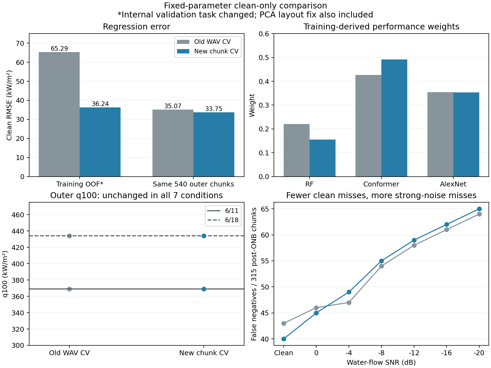

# chunk内部検証のclean_only結果と次のモデル比較

解析日: 2026-10-06。修正後の実行は全7雑音条件で完了し、同じ外側540 chunkで旧clean_onlyと比較できる。**回帰誤差は小幅に改善したが、主目的であるq100の早期化は両日・全条件で得られなかった。次は新chunk条件で追加モデルの補完を比較し、既存モデルの組合せも対照として残す。**

## 実行完了と比較条件

[対象run](run_scope.json)は10/5の修正後clean_onlyと10/1の旧clean_onlyだけ。RF保存で止まった先行runを結果へ混ぜず、以前のmatched比較は保持する。

6/11＋6/18、3 kHz、1秒、選別なし、PCA100、同じ既存3モデルの採用パラメータ。外側学習1620／評価540のIDと正解が一致し、両日とも各270評価chunk。最終Conformerは150 epochs/batch12、AlexNetは150 epochs/batch8を完走し、メモリ不足による途中終了はない。cleanだけから得た同じモデル・前処理・重みを7条件へ適用した。新実行の3最終モデルは保存・再読込確認がすべて差0で通過している。

変更には、内部WAV分離からシャッフルありchunk 3-foldへの切替に加え、PCAメモリ配置の数値互換性修正も含まれる。新旧差を分割だけの因果効果とは呼ばない。内部各fitは1080、検証540、全36 WAVを含み、同じchunk共有0、外側テスト除外、全1620が1回ずつ検証されていた。[監査](audit.json)、[fold支持](internal_fold_support.csv)、[実epoch/batch](actual_training.csv)。

評価の閾値は元の収録日別に6/11が221.5051102、6/18が271.6776816 kW/m²。2日統合runの平均閾値で判定する標準出力とは区別して、ここでは保存予測から日別閾値を適用した。合計ONB前225、ONB以上315、ONB近傍30評価chunkである。q100は、その段階とそれより高い全実測段階の全評価chunkが閾値以上となる最小熱流束。有限標本の到達段階であり、実時間遅延や将来の100%保証ではない。

## 外側の主比較

以下はperformance統合。同じ学習外540 chunkでの比較、RMSE単位はkW/m²。全単体・等重み・日別の通常指標は[指標表](full_metrics.csv)、段階別の判定は[段階表](stage_profiles.csv)にある。

| 評価条件 | 全域RMSE 旧→新 | FN 旧→新 | FP 旧→新 |
|---|---:|---:|---:|
| clean | 35.07→33.75 | 43→40 | 1→1 |
| 0 dB | 53.36→52.54 | 46→45 | 1→1 |
| −4 dB | 62.86→62.60 | 47→49 | 1→0 |
| −8 dB | 68.16→68.05 | 54→55 | 0→0 |
| −12 dB | 72.20→72.38 | 58→59 | 0→0 |
| −16 dB | 76.72→76.20 | 61→62 | 0→0 |
| −20 dB | 82.46→80.67 | 64→65 | 0→0 |

cleanのONB近傍RMSEは45.46→39.88、Recallは86.35→87.30%。FN3件を訂正し、新たな判定誤りは増えなかった。6雑音の平均RMSEは69.30→68.74、強雑音−12/−16/−20の平均は77.13→76.42と小幅改善する。一方、強雑音の平均FNは61→62、近傍RMSEは103.54→108.75へ悪化した。特に−20 dBでは全域誤差が減ってもFNは1件増え、近傍RMSEも85.94→94.75である。[平均](noise_aggregates.csv)、[訂正と追加](corrections.csv)。

| 収録日 | q100 旧→新 | g100 旧→新 | 新q100以降の評価数 |
|---|---:|---:|---:|
| 6/11 | 368.98→368.98 | 147.47→147.47 | 8段階・120 chunk |
| 6/18 | 434.02→434.02 | 162.34→162.34 | 7段階・105 chunk |

このq100/g100は全7条件で同じで、14日別・雑音セルすべて不変。今回の目的に対しては「回帰の小幅改善、到達段階の改善なし」と評価する。[到達段階](endpoints.csv)。



[共有用PDF](comparison_summary.pdf)。内部OOFの棒は検証課題が変わった比較として読む。

## 内部OOFと重みの変化

| clean学習OOF | 旧WAV分離 | 新chunk分割 |
|---|---:|---:|
| performance全域RMSE kW/m² | 65.29 | 36.24 |
| ONB近傍RMSE kW/m² | 68.35 | 35.03 |
| performance FN／945 ONB以上chunk | 133 | 104 |
| 全3モデル共通FN | 100 | 52 |
| performance FP／675 ONB前chunk | 1 | 1 |
| 日別q100 kW/m² | 368.98／434.02 | 368.98／434.02 |

各内部fitに全段階の例が残る検証へ切り替えたことで、内部指標と共通FNは大きく変わった。しかし未知WAVから既知WAV内の検証へ課題自体が変わっているため、その差をモデル能力の向上率とはしない。現在の外側既知WAV評価と問いを揃えたことに価値がある。結果だけから以前のONB欠如をすべての共通失敗の原因と確定することもできない。

内部OOFは重みの作成にも使う診断値で、統合方式を新たに選んだ場合の独立した最終性能ではない。新しい重み・統合器の採否では選択と評価を分ける。同じ外側540も既に研究判断へ利用した開発上の比較対象であり、未知日の独立確認とは区別する。

performance重みはRF21.99→15.57%、Conformer42.59→49.13%、AlexNet35.42→35.30%。最終ConformerとAlexNetの予測は、全7条件・各540 chunkで旧結果と完全一致した。RFはPCA計算経路の修正を含む再学習で変わっている。[重み](weights.csv)、[単体予測差](prediction_changes.csv)。

旧単体予測へ新しい学習側重みだけを適用すると、clean RMSEは35.07→33.52、FN43→40となった。新単体予測に旧重みを適用したRMSEは35.31、実際の新統合は33.75だった。cleanの改善は主として重み変更と整合する。ただし外側正解から重みを選び直したものではなく、記述的な分解である。[予測と重みの対照](prediction_weight_decomposition.csv)。

## q100を遅らせている最後の陰性

### 学習側で残る共通見逃し

| 新clean OOFの収録日 | 最後の陰性段階 kW/m² | 統合の陰性数／45 | そのうち全3モデル陰性 |
|---|---:|---:|---:|
| 6/11 | 315.47 | 4 | 4 |
| 6/18 | 376.32 | 2 | 1 |

6/11の4件はchunk17/25/28/36。6/18はchunk32/33で、33が共通陰性である。[chunk一覧](false_negative_chunks.csv)。このような予測が一つでもある限り、既存3出力の非負・総和1の平均ではその段階を全陽性へできない。新しいOOFで両日のq100を早めるには、重みだけでなく有効な予測情報を増やす比較が必要になる。[凸平均の必要条件](convex_average_necessary_conditions.csv)。この表の条件を満たしても、全chunkを救う一つの共通重みがあるとは限らない。

以前保存した同じ1620学習chunkの特徴を新しいOOF判定へ照合すると、最後の陰性は同じWAVの陽性chunkより弱い傾向が残っていた。6/11の2.1–2.5 kHz log-power中央値は陰性−9.32／陽性−6.51、時間power変動CVは0.42／2.82。6/18は−8.97／−6.37、CV0.71／1.85だった。陰性4件・2件という少数例の記述であり、気泡がない・正解ラベルが誤り・1秒では識別不可能とは断定しない。**ONB支持を改善しても弱い区間の共通見逃しが残るため、単なるfold問題以外の特徴利用を検討する根拠**になる。[特徴対照](bottleneck_feature_contrasts.csv)。古いfold番号と旧失敗ラベルは再利用していない。

### 外側では統合で失われる補完もある

外側cleanの最後の陰性は、両日とも15件中1件で全モデル共通陰性ではなかった。6/11の315.47段階・chunk21では参照ONBからの予測余裕がRF−120.37、Conformer−6.25、AlexNet＋4.36、統合−20.27 kW/m²。6/18の376.32段階・chunk31ではRF−145.25、Conformer＋21.78、AlexNet＋6.03、統合−9.78だった。

固定対照としてConformerとAlexNetを等平均すると、外側cleanの6/18 q100は434.02→322.11へ早まり、FPは1のまま。ただし同じ組合せは学習OOFのq100を両日とも改善せず、6/11外側と−20 dB転送も改善しなかった。外側だけを見てこの統合を採用しない。**新モデルを探す理由と、既存予測を統合で活かす理由が併存している。** [固定組合せ](fixed_subset_endpoints.csv)。

clean外側の統合FN40件中23件は全モデル共通、17件は少なくとも1モデル陽性。一方−20 dBのFN65件はすべてRFに陽性があるが、RFのONB前FPは215／225（FPR95.56%）。陽性を出すモデルがあるだけでは有用な補完といえず、雑音で上方へ偏った予測を増やす統合では誤報との関係も確認する必要がある。[補完可能性](complementarity.csv)。

## 次に進める比較

第一に、新しい学習側chunk分割で、以前の10特徴を使うSVRとHistGradientBoostingの小規模対照を行う。以前の予備結果はWAV分離だったので、候補をそのまま不採用にも採用にもしない。同じ1620学習ID・同じfoldで比べ、パラメータと前処理の選択を学習側へ限定する。[次の条件案](../../configs/experiments/2026-10-06_chunk_complementary_model_pilot_plan.json)。

第二に、主に次を確認する。最後の共通陰性を訂正できるか、同じか高い段階へ新しい陰性を作らないか、日別q100/g100を早めるか、ONB前誤報や全域品質にどの代償があるか。ONB近傍RMSEは説明用の補助に置く。逆方向出力の多さや残差相関の低さだけで候補を選ばず、共通失敗の訂正と追加誤りを多様性の具体的な指標にする。

同じ特徴では補えなければ、1秒内の細かい周波数形状・時間powerの分布を一つ追加し、同じモデルで入力の効果を分ける。全域特徴とq100を決める弱い区間で役立つ情報が同じとは限らない。新モデルの違いと入力の違いを一度に増やさない。

候補単体が補完できたら、その利点が統合へ移るかを確認する。既存performance・等重み・事前に決めた部分集合を対照とし、必要なら学習側で重みや部分集合を選ぶ。追加モデルを平均に入れただけで成功とはしない。既存OOFの最後の共通陰性が残るので、既存モデルの非負重み探索だけを唯一の次工程にも据えない。

cleanの補完を選んだ後に、同じモデルをnoiseへ固定転送する。noiseを重み選択へ用いるなら、3既存モデルにもcleanでfitしたfoldモデルのnoisy OOFが必要であり、旧matched OOFは代用できない。今回保存したのは最終モデルで、内部の一時モデルの保存とは異なる。

XAIは保存された最終モデルで、外側の最後の陰性例と同じWAVの陽性例を比較できる。学習OOFの失敗を最終モデルで説明した場合は別の予測の説明になるため、同じOOF予測を説明したとしない。候補が絞れた後に追加seedで再現性を確認し、別日で適用範囲を確かめる。今すぐmatched一式、未知日、時間block、全パラメータ再探索を必須にはしない。

## 検算と再現

保存予測から210条件のRMSE/FP/FNと、140個の日別q100/g100を別計算で照合し、performanceの14比較セル不変を確認した。[検算](verification.json)。主コード・条件設定・原結果は変更せず、新学習とXAI推論は実行していない。

```powershell
python -X utf8 experiments/2026-10-06_chunk_clean_baseline_analysis/analyze.py
python -X utf8 experiments/2026-10-06_chunk_clean_baseline_analysis/verify_outputs.py
python -X utf8 experiments/2026-10-06_chunk_clean_baseline_analysis/plot_summary.py
```
