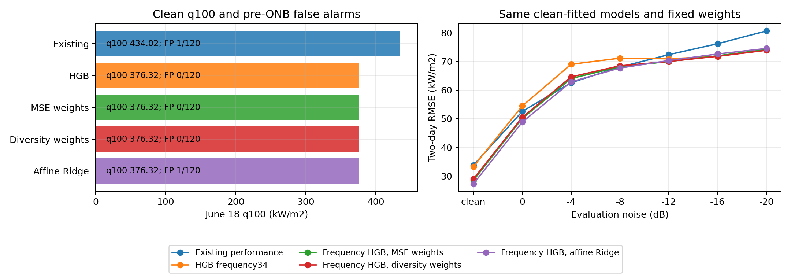

# chunk条件の追加モデルと入力表現と統合の比較

実施日：2026-10-06。本人依頼の1〜4に対応して、SVRとHistGradientBoosting回帰（HGB）の学習、最後の共通陰性の訂正確認、入力表現の追加、統合方式の比較まで実施した。**周波数形状を加えたHGBは有用な補完候補になったが、6/11のq100は解決していない。多様性を使った重みも改善を示す一方、通常の重み最適化に対する一律の優位はない。**

本人の回答に従い、q100と誤報を併記する。誤報の許容数を勝手に決めず、採用方式を一つに確定しない。基準runとmatchedは保持し、主実行コードは既存3モデルのまま。追加モデルと統合は、保存モデルを伴う研究用の比較スクリプトとして実装・実行済みである。

同日後続：本人からq100以外の性能改善もモデル追加の重要な目的と補足された。[同方式の既存3対照と他指標の再評価](../2026-10-06_model_addition_general_metrics_review/README.md)を追加。既存3にも同じMSE重みを適用するとclean6/18 q100は376.32になるが、HGB追加でRMSE32.41→28.46、MAE25.07→19.50、FN35→24、FP1→0の利得が残る。次の優先は固定候補の再現性・改善/悪化領域の説明で、最後のq100陰性の識別を候補価値の前提としない。以下は最初の予備比較時点の固定記録。

## 1 実施した条件と比較の範囲

| 工程 | 実施内容 | 状態 |
|---|---|---|
| 1 同じ入力で候補比較 | 以前と同じ10特徴、SVRとHGB、3種類の選択方針 | nested chunk OOFと最終モデルを取得 |
| 2 最後の失敗と追加誤り | 共通FN訂正、最後の陰性訂正、同段階以上の新FN、日別q100とFP | 学習側と外側の両方を集計 |
| 3 入力表現の追加 | 周波数34特徴と時間46特徴を別々に追加。HGBの固定値対照も実施 | モデル系列と入力、調整の効果を分けて確認 |
| 4 統合 | 等平均、inverse-MSE、固定25%追加、重み最適化、多様性項、q100/FP方針別の重み、切片付きRidge | 学習側で固定した29方式を外側7条件で評価 |

対象は[直前のclean_only基準](../2026-10-06_chunk_clean_baseline_analysis/run_scope.json)の6/11＋6/18、3 kHz、1秒、選別なし。外側は既存の学習1620／テスト540、各WAV45／15 chunk、seed42。学習とテストの同一chunk共有は0、同じ36 WAVを意図して共有する。未知WAV・未知実験日の一般化の結果ではない。

既存3モデルの保存clean OOFの**元のsample順序**とfit/validation indicesを再現し、3-fold shuffled chunk KFoldを使った。追加モデルの各OOF fit1080の内部で、さらに3-foldに分けてパラメータを選び、保持540を予測した。前処理と目的変数MinMaxScalerは各fitだけで学習する。最終候補は全1620の学習側CVで値を選び、全1620でfitした。収録日、WAV ID、chunk番号、真値、雑音入力に対応するclean参照は予測特徴へ入れていない。

SVRはRBF、C=1/10/100、epsilon=.02、gamma=scale、入力StandardScaler。HGBはmax_leaf_nodes=7/15/31、150 iterations、learning_rate=.05、min_samples_leaf20、L2=1、early_stopping=False。実行環境はscikit-learn **1.6.1**。両者の仕組みと設定の意味は[SVR公式資料](https://scikit-learn.org/stable/modules/generated/sklearn.svm.SVR.html)、[HGB公式資料](https://scikit-learn.org/stable/modules/generated/sklearn.ensemble.HistGradientBoostingRegressor.html)で確認した。

選択方針はRMSE、q100優先、FP優先の3つ。後二つは日別g100とFPを辞書式に並べる対照であり、本人が誤報許容値を承認したという意味ではない。2系列×3入力×3方針＝**18候補方針**で、同じ予測になる方針も含む。候補・固定入力対照271 fitとRidge3 fitを行い、58件の学習済みjoblibを保存した。

統合候補は学習側clean OOFのRMSE、q100、FP、最後の共通陰性訂正から3候補に絞った。統合重みとRidgeもこの学習側だけで決め、[固定記録](frozen_integration.json)を作ってから外側を評価した。外側の正解から再選択・再調整はしていない。ただしこの外側集合は以前から研究判断に利用しているため、今回も**開発上の比較**である。

追加候補のnested OOFと、統合の学習側fit診断を区別する。既存OOFを使ってfitした重みやRidgeの学習側指標は、統合全体の独立したnested検証ではない。OOFでメタモデルを学習する考え方は[StackingRegressor公式資料](https://scikit-learn.org/stable/modules/generated/sklearn.ensemble.StackingRegressor.html)にも示されるが、そのfit指標を独立な評価とはしない。今回の統合の比較には、固定後の外側予測を使う。

## 2 同じ10特徴でも6月18日の補完が得られた

学習側clean OOFの基準performanceはRMSE36.24、FN104、FP1。最後の陰性は6/11の315.47に4 chunk、6/18の376.32に2 chunkである。

同じ10特徴のSVR・HGBは、6/18のq100を434.02から376.32へ早めた。6/11は全候補で368.98のまま。例えばFP優先HGBはFN59、FP9、RMSE39.35で、FNとq100の改善と誤報・回帰誤差の増加が同時に起きる。SVRのFP優先もFN106、FP3、RMSE55.55であり、q100の一部分の改善だけから全体に良いモデルとは判断しない。

したがって、以前のWAV分離条件の候補不採用を新chunk条件へそのまま移すべきではなかった。一方、全段階の学習例が内部fitに入ることで、すべての最後の陰性が解決するわけでもなかった。

根拠：[全候補の学習側指標](candidate_metrics_all.csv)、各系列の`*_audit.json`。

## 3 周波数形状の追加と時間分布の追加は異なる結果になった

基礎10特徴は帯域log power、帯域比、周波数重心、スペクトルentropy、全帯域の時間CV。周波数34はこれに125 Hz幅24帯域の相対log powerを加え、全体の音量だけでは表せない帯域形状を残す。時間46は、500 Hz幅6帯域それぞれの時間powerの10/50/90%点、CV、peak/mean、平均の2倍超の割合を加える。元入力は224×224にresize済みで、Hz境界は近似座標である。時間46は分布の特徴であり、時間順序やイベント間隔を保持するものではない。

調整後の周波数HGBは、学習側clean OOFでRMSE32.40、FN49、FP4。既存3モデル共通FN52のうち22を陽性へ訂正し、基準が陽性だったchunkへ新FN5を作った。最後の共通陰性5件のうち3件を訂正した。残差相関はRF/.433、Conformer/.485、AlexNet/.369で、完全に逆方向のモデルではないが、有用な訂正が実際に増えた。

モデルの値も別々に調整しているため、入力だけの影響を調べる追加対照としてHGBのmax_leaf_nodesを全入力で15に固定した。この対照は外側結果確認後の診断であり、新しい独立確認とはしない。

| HGB固定15の入力 | 学習側clean RMSE | 外側clean RMSE | 外側clean FP/FN | 外側−20 RMSE | 外側−20 FP/FN |
|---|---:|---:|---:|---:|---:|
| 基礎10 | 37.87 | 37.73 | 0 / 21 | 98.32 | 1 / 49 |
| 周波数34 | 32.37 | 33.26 | 1 / 19 | 75.00 | 1 / 49 |
| 時間46 | 32.77 | 30.87 | 2 / 19 | 106.05 | 92 / 28 |

周波数追加には、同じHGB設定でも回帰・雑音転送を改善する根拠がある。時間追加はcleanでは良いが、この固定値では−20の誤報が92/225へ増えた。調整後の時間HGB31では−20のFPは4、RMSE75.11まで抑えられており、入力と木の複雑さの組合せに敏感である。「時間変動を残せば雑音に強い」とは結論しない。

SVRも残すが、今回の基礎10・FP優先SVRは外側−20でFP225/225、RMSE213.54となった。過大予測で見逃しが減ることと、有用な補完を区別する必要がある。

根拠：[固定入力対照](fixed_input_ablation_metrics.csv)、[対照条件](../../configs/experiments/2026-10-06_chunk_fixed_input_ablation.json)、[補完と相関](shortlist_diversity.csv)。

## 4 統合すると補完が使えるが等平均では薄まった

以下は同じ外側clean540 chunk。熱流束とRMSEはkW/m²、FNの母数315、FPの母数225。

| 方式 | RMSE | FN | FP | 6/11 q100 | 6/18 q100 |
|---|---:|---:|---:|---:|---:|
| 既存performance | 33.75 | 40 | 1 | 368.98 | 434.02 |
| 既存Conformer＋AlexNet等平均 | 33.30 | 31 | 1 | 368.98 | 322.11 |
| 周波数HGB単体 | 33.25 | 21 | 0 | 368.98 | 376.32 |
| 周波数HGBを加えた4等平均 | 34.38 | 44 | 1 | 368.98 | 434.02 |
| 周波数HGB＋MSE最適化重み | **28.46** | **24** | **0** | 368.98 | **376.32** |
| 周波数HGB＋多様性項付き重み | 28.94 | 23 | 0 | 368.98 | 376.32 |
| 周波数HGB＋切片付きRidge | 27.23 | 26 | 1 | 368.98 | 376.32 |

MSE重みはRFほぼ0、Conformer20.61%、AlexNet18.85%、HGB60.54%。4候補から実効的に3モデルへ重みが集まった。4等平均ではRFの負側出力を含めて候補の訂正が薄まり、q100もFNも改善しなかった。候補を追加することと、候補の予測を統合で活かすことを両方検証する必要がある。

MSE重みのclean FN40→24は、既存FNの訂正16・追加FN0から生じた。既存3モデル共通FN23のうち5を救っている。周波数HGB単体では共通FN9を救ったが、統合すると一部の補完が再び陰性へ戻る。6/11の最後の外側陰性は1/15のままで、その予測marginは基準−20.27からMSE統合−94.85へ下がる。q100が同じでも、残る失敗の大きさは同じではない。

6/18のg100は162.34→104.64、q100の前進幅は57.70。ただし既存2深層モデル対照は外側cleanのq100=322.11で、今回候補より早い。学習側ではこの2モデルのq100が434.02のままなので、外側の値だけで方式を選ばない。**外側cleanのq100改善だけでは、第4モデルが必要という証明にはならない。** 新モデルの根拠は学習側と外側で実際に共通FNを訂正したこと、回帰と雑音転送との組合せまで含めて読む。

切片付きRidgeは凸結合の範囲を越えられるが、今回も6/11 q100は不変。clean RMSEは改善する一方、FNとFPではMSE重みに劣る。今回の結果から、平均以外の複雑な統合が必須と結論する根拠はない。

根拠：[外側通常指標](outer_metrics.csv)、[訂正と追加誤り](outer_complementarity.csv)、[各段階の陽性数と最小margin](outer_stage_profiles.csv)、[重みの固定記録](frozen_integration.json)。

## 5 多様性の着眼点には意味があるが指標の選択が残る

輪講論文は依存構文解析の離散的な予測先にsociety entropyを用いる。[原論文3.2節と式9〜10](https://arxiv.org/html/2412.11543v2#S3.SS2)。今回の残差相関と同じ指標ではない。ここでは「品質と誤りの重なりを同時に考える」という着眼点を、小規模な回帰の対照へ移した。

通常のMSE最小化に、正の残差相関を持つモデルへ同時に重みを置くことへの罰則を加えた。対角を0にした相関行列Cを使い、`MSE(Pw,y) + λ wᵀCw`を、非負・重み和1の制約で探索した。λは事前に基準OOF MSEの.25倍と固定し、外側から調整していない。これは独自の探索的な対照で、輪講手法の再現や最適な多様性指標の確定ではない。

この項でHGB重みは60.54→67.73%、Conformer20.61→14.15%、AlexNet18.85→18.11%となった。clean FN24→23、−20 FN61→58は良くなり、FPは両方式とも全7条件0。一方clean RMSE28.46→28.94、6雑音平均66.41→66.55で、q100も両方式同じだった。したがって**今回の多様性項には見逃し減少の兆候があるが、q100を早める追加の利得は確認していない。** ONB段階ごとの同時失敗を直接扱う指標と、全域残差相関を区別する課題が残る。

q100優先の有限重みgridでは候補重み1が選ばれた場合もある。早い到達段階を最優先すると常に統合が最適とは限らない。FP優先の重みとも併記し、単体を含む比較として扱う。

## 6 雑音下の回帰改善とq100と近傍誤差を分ける

| 方式 | 6雑音平均RMSE | −20 RMSE | −20 FN | −20 FP | −20 ONB近傍RMSE |
|---|---:|---:|---:|---:|---:|
| 基準performance | 68.74 | 80.67 | 65 | 0 | 94.75 |
| 周波数HGB単体 | 68.59 | 74.19 | 49 | 0 | 107.28 |
| MSE最適化重み | 66.41 | 74.17 | 61 | 0 | 112.27 |
| 多様性項付き重み | 66.55 | 73.90 | 58 | 0 | 113.12 |
| 切片付きRidge | 66.15 | 74.56 | 62 | 0 | 116.91 |

固定MSE・多様性重みの6/18 q100はclean/0/−4で376.32、−8以下で434.02。6/11は全7条件368.98。全域誤差を改善しても、強雑音のq100は動いていない。−20の近傍誤差は悪化する。本人の主評価はq100だが、回帰の目的との整合を判断するため、この代償も保存する。

周波数HGB単体は−8でも6/18 q100=376.32だが、統合では434.02へ戻る。雑音条件ごとの候補の訂正を固定clean重みが活かしきれていない。ただし、今ある既存noise OOFはmatchedで学習されたものなので、clean-fit雑音予測として代用してnoise重みを選ぶことはできない。



図は6/18 cleanのq100とFP、両日poolの雑音別RMSE。数値の詳細は[要約比較](summary_comparison.csv)、[雑音集計](noise_aggregates.csv)。

## 7 残る共通失敗と次の識別比較

**確認事実**：学習側6/11の315.47のchunk17・25は新候補で訂正できる。一方chunk28・36は今回18候補方針すべて陰性。既存3を合わせた最大marginもそれぞれ−30.50、−107.83である。したがって、この保存OOF予測集合の非負平均では、両chunkを陽性へ引き上げられない。6/18の最後のchunk32・33には陽性候補があり、新モデルが使える補完を増やした。根拠：[最後の失敗の予測margin](training_last_stage_margins.csv)、[凸結合の必要条件](training_convex_feasibility.csv)。これは今回のモデル・入力・OOFに対する結論で、追加モデル一般の不可能性ではない。

**原因仮説**：6/11の弱い音響区間では、今回の帯域要約と時間分布が段階識別に十分な情報を残していない可能性がある。実際に1秒内の気泡音が弱い可能性、録音状態や正解の時間単位の問題もある。全候補が低く予測するだけでは、気泡がなかったともラベルが間違っているとも確定しない。固定時間HGBの強雑音誤報は、入力分布の変化と設定への感度の別課題である。

**次の比較の順序**：

1. 周波数HGB31とMSE重みを本比較の候補として固定し、多様性重みを対照に残す。主コードへの採用時も単体HGB・既存2モデル・4等平均を対照から外さない。q100・FPの双方を判断する本人方針を維持する。
2. 6/11のchunk28・36と、同じWAVの成功chunkを対にして、元波形・時間順序を持つスペクトログラムと近傍chunkを確認する。次の入力候補は、今回失った時間順序や狭いピークの構造を残すものに絞る。これが弱い音の違いを識別するかが、さらに別のモデルを追加する判断材料になる。
3. clean-fit強雑音のq100を目標に重みを変えるなら、既存内部foldモデルの再学習または保存を行い、3モデルともcleanでfitした雑音OOFを作る。新候補だけの雑音OOFやmatched OOFから全体の雑音重みを推定しない。
4. 採用の確定には固定候補の分割seed感度を確認する。未知WAV・未知日の再実験を今回の必須工程に追加しない。既知WAV評価の再現性と、将来の未知日の確認をそれぞれの目的で扱う。

すぐに本人が実行し直す必要はない。必要な予備学習と評価は完了している。物理的原因まで確定する場合は、当該1秒で実際に気泡が出たかを示す同期映像や実験記録、録音異常の有無の情報が必要になる。全段階のラベルと音響入力だけから、その事実をAIが確定することはできない。q100の100%はこの有限標本の全陽性であり、発生時刻や将来の判定確率100%を表さない。

## 8 保存物と確認結果

[実行条件](../../configs/experiments/2026-10-06_chunk_complementary_model_pilots.json)、[要約JSON](summary.json)、[検算記録](verification.json)。指標1272行、日別q100/g100848件を別計算で検算。保存モデルからnested held予測108、最終候補126、固定統合203集合を再現した。元の3モデルや過去runは再学習・上書きしていない。

初回の順序は次のとおり。学習phaseは完了結果の誤上書きを防ぐため、既存候補があれば停止する。保存物の確認には`verify_outputs.py`を使う。

```powershell
$env:LOKY_MAX_CPU_COUNT='2'
python experiments/2026-10-06_chunk_complementary_model_pilots/pilot.py --phase baseline
python experiments/2026-10-06_chunk_complementary_model_pilots/pilot.py --phase representations
python experiments/2026-10-06_chunk_complementary_model_pilots/pilot.py --phase integrate
python experiments/2026-10-06_chunk_complementary_model_pilots/pilot.py --phase evaluate
python experiments/2026-10-06_chunk_complementary_model_pilots/fixed_input_ablation.py
python experiments/2026-10-06_chunk_complementary_model_pilots/verify_outputs.py
python experiments/2026-10-06_chunk_complementary_model_pilots/summarize.py
```

外側全50方式×7条件のchunk予測は[outer_predictions.csv](outer_predictions.csv)、固定入力対照は[fixed_input_ablation_predictions.csv](fixed_input_ablation_predictions.csv)。全候補のfoldモデル、最終モデル、feature cache、fit indices、選択スコアも同じフォルダに保存した。説明性mapの追加計算、主runnerへの候補採用、matchedの新規再学習は今回の予備比較に含めていない。
