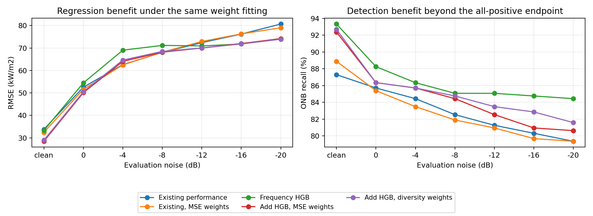

# 追加モデルの効果を回帰と判定と雑音耐性から見直す

2026-10-06。本人から「q100は重要だが、モデル追加による他の評価指標の改善も調べたい」と補足された。**追加モデルをq100改善の手段に限定せず、熱流束回帰、固定閾値のONB判定、雑音下の性能、統合の補完を並行して評価する。今回の周波数特徴HGBには、q100以外から見ても残す価値がある。**

同日後続：[固定候補の追加2 seedと説明・統合の追検証](../2026-10-06_hgb_followup_validation/README.md)を完了した。cleanの回帰・見逃し改善は両seedでも確認したが、強雑音はseed43でHGB単体FP88、統合RMSE悪化、seed44で改善した。以下のseed42の雑音下利得を、分割に依存しない一般的な雑音耐性とは読まない。今後の優先と本人確認部分は追検証記録を参照する。

前回のRMSE33.75→28.46には、モデル追加と重み決定方式の変更が重なっていた。今回、既存3モデルにも同じMSE重み最適化を適用する対照を加えた。これと比べても、HGBを加えた統合のclean RMSEは32.41→28.46、MAE25.07→19.50、FN35→24、FP1→0となった。したがって、改善を重みの変更だけで説明することはできない。一方、統合はHGB単体の判定性能を一律に上回らない。

## 1 今回の確認範囲

前回の[追加モデル予備比較](../2026-10-06_chunk_complementary_model_pilots/README.md)と同じclean_only、6/11＋6/18、3 kHz、1秒、選別なし、外側学習1620／テスト540を使う。日別の確定ONBを使い、熱流束・誤差の単位はkW/m²。同じ元WAV内の未使用chunkに対する開発比較であり、未知録音や未知日の結果ではない。

保存済みclean学習OOFだけで、次の7対照をfitして固定した後、外側予測を読み込んだ。

- 既存RF・Conformer・AlexNetのMSE重み、多様性項付き重み、切片付きRidge。
- Conformer＋AlexNet、Conformer＋HGB、AlexNet＋HGB、Conformer＋AlexNet＋HGBのMSE重み。

HGBは前回学習側で選ばれた周波数34特徴・max_leaf_nodes31の候補を固定した。新たなモデル系列・入力・ハイパーパラメータ探索は行わず、元モデルの再学習もしていない。今回の追加meta fitは既存3モデルのRidge1件。重みとmetaの学習側指標はfit診断であり、nestedな統合検証ではない。前回と同じく、既に研究判断に利用した外側への追加診断である。

根拠：[条件書](../../configs/experiments/2026-10-06_model_addition_general_metrics_review.json)、[対照の固定記録](frozen_controls.json)、[検算記録](audit.json)。全21方式×7条件×pool/2日＝441指標行を保存し、既存方式の数値を再現、新対照のRMSE・FP・FNを別計算で確認した。

## 2 q100不変と他指標の改善は両立する

q100は、全chunkをONB陽性とする最小実測段階で、最後の陰性chunkが残る段階と測定刻みに大きく左右される。例えば同じ高い段階に1件の陰性を残したまま、それより低い段階の見逃しを20件訂正しても、q100は変わらない。回帰誤差を広く減らしても、最後の1件が閾値を越えなければ同じである。

したがってq100は重要な到達条件を測るが、全体の精度改善を要約する指標ではない。モデルの採否に「q100が前進すること」を一律の必須条件として置くと、見逃しや回帰誤差を減らすモデルを取り逃がす。今後は次の問いをそれぞれ判定する。

| 問い | 中心に読む指標 | 読み方 |
|---|---|---|
| 熱流束をどれだけ正しく回帰するか | RMSE・MAE、R²、符号付きbias | 大きい誤差と典型的な絶対誤差を分ける。同一標本のR²はRMSEと同じ二乗誤差に基づくので、独立な証拠3つとは数えない |
| 固定ONB閾値でどれだけ検知するか | FN/RecallとFP/FPR、Precision/F1 | Recallを過大予測だけで上げていないかを確認。誤報許容値は本人方針として仮定しない |
| どの段階から全標本を陽性とできるか | 日別q100/g100 | 重要指標として保持。個々のchunk改善と有限集合の全陽性到達を分ける |
| 雑音でどれだけ悪化するか | 各SNRの絶対RMSE/MAE・判定、cleanからの差 | clean改善だけで雑音劣化抑制を主張しない。平均と各条件の悪化箇所を併記 |
| 統合だから得られる利得があるか | 同方式の追加なし対照、候補単体、訂正と追加誤り | 既存3→4という個数だけでなく、役立つ予測と組合せを評価 |

今回のq100への効果もゼロと一括しない。6/11は不変で、clean6/18は既存3の重み調整だけでも376.32になる。一方、6/18の0/−4では既存3 MSE重みが434.02、新HGB統合が376.32で、限定的な追加利得がある。**今回の新モデルの根拠の中心は、q100を含む複数の性能軸で改善の範囲と代償を示すこと**である。

## 3 重みの方式を揃えても追加モデルの価値が残った

以下は同じ外側clean540。ONB以上315、ONB未満225。

| 指標 | 現行performance | 既存3のMSE重み | HGBを含むMSE重み | HGB単体 |
|---|---:|---:|---:|---:|
| RMSE | 33.75 | 32.41 | **28.46** | 33.25 |
| MAE | 26.01 | 25.07 | **19.50** | 19.93 |
| R² | .9844 | .9856 | **.9889** | .9849 |
| Recall | 87.30% | 88.89% | **92.38%** | **93.33%** |
| FN | 40 | 35 | **24** | **21** |
| FP | 1 | 1 | **0** | **0** |
| F1 | .9306 | .9396 | **.9604** | **.9655** |
| 6/11 q100 | 368.98 | 368.98 | 368.98 | 368.98 |
| 6/18 q100 | 434.02 | 376.32 | 376.32 | 376.32 |

既存3の重み調整だけでもRMSEとFNは良くなるが、HGBを含めるとさらにRMSE12.2%、MAE22.2%低下し、見逃し11件を追加FN0で訂正した。FPも1件を訂正し、新FP0。両日とも回帰誤差が改善する。cleanの日別RMSEは6/11で34.88→32.43、6/18で29.73→23.83。

cleanでは36 WAVのうち28で二乗誤差を減らし、8で増やした。最大改善WAVの寄与は純改善量の24.8%で、単一のWAVだけに依存する改善ではなかった。元WAV単位の日別paired再標本化3000回では、追加あり−なしのRMSE差−3.95に対する2.5–97.5%区間は−7.22〜−.22、MAE差−5.57では−7.62〜−3.33。ただしこれは学習済み状態を固定した標本構成への感度で、追加seed・独立実験日の確認ではない。

clean AUCは一律改善ではない。日別ROC-AUCは6/11で.99648→.99584、6/18で.99750→.99928。既に高い順位識別性能の小さな変化と、固定閾値でのFN減少を区別する。pool AUCは日ごとにONB閾値が異なる集合の生の熱流束予測の順位であり、日別AUCも併記する。

MSE重みは既存3がRF5.90%、Conformer57.63%、AlexNet36.47%。追加ありはRFほぼ0、Conformer20.61%、AlexNet18.85%、HGB60.54%。Conformer＋AlexNet＋HGBだけの対照も同じ予測になる。**候補追加の恩恵は確認できたが、実際の採用形は常に4モデルである必要がない。RFを含む候補集合から3モデルへ重みが集まる形も検討できる。**

根拠：[通常指標](all_metrics.csv)、[訂正と追加](paired_error_changes.csv)、[WAV別改善](wav_gain_distribution.csv)、[再標本化](paired_bootstrap.csv)。

## 4 雑音下にも恩恵があるが全条件と全領域には広がらない

| 条件 | 既存3 MSEのRMSE | HGB統合のRMSE | 既存3 MSEのFN | HGB統合のFN |
|---|---:|---:|---:|---:|
| clean | 32.41 | **28.46** | 35 | **24** |
| 0 dB | 51.60 | **50.10** | 46 | **43** |
| −4 dB | **62.45** | 64.05 | 52 | **45** |
| −8 dB | **68.14** | 68.15 | 57 | **49** |
| −12 dB | 72.90 | **69.99** | 60 | **55** |
| −16 dB | 76.29 | **71.99** | 64 | **60** |
| −20 dB | 78.99 | **74.17** | 65 | **61** |
| 6雑音平均 | 68.40 | **66.41** | 57.33 | **52.17** |

HGB統合のFPは全7条件0。既存3 MSEはclean/0で各1、ほか0。MAEはHGB統合が全7条件で低い。−4ではMAE48.31→46.29と改善してもRMSE62.45→64.05に悪化するため、「どの指標でも改善」ではない。−20のRMSE改善は24/36 WAVで見られ、両日RMSEも低下する。

領域別に読むと、改善の中身がさらに分かる。

| 領域 | cleanの既存3→HGB統合RMSE | −20の既存3→HGB統合RMSE |
|---|---:|---:|
| 60 kW/m²未満 | 29.38→33.54 | 119.05→108.41 |
| 60〜ONB未満 | 22.70→20.81 | 46.53→49.01 |
| ONB〜1.5 ONB未満 | 46.00→36.46 | 115.19→111.27 |
| 1.5 ONB以上 | 31.20→24.69 | 33.13→29.36 |
| ONBの±10%近傍 | 33.35→21.56 | 108.66→112.27 |

−4の全域二乗誤差悪化は、60未満の過大予測増加に集中していた。ここはbias93.71→103.73で、FPは増えなくても回帰誤差は大きい。逆に−20の全域二乗誤差減少の約72.9%は60未満の改善から来る。ONB以上でも誤差を減らすが、強雑音下のONB近傍30 chunkは両方式とも全件陰性で、近傍RMSEは悪化する。これは全域改善の根拠を否定するものではなく、どこまで改善したかを限定する事実である。

clean→−20のRMSE増加量は46.58→45.72で、差は.86にとどまる。今回は「強雑音での絶対誤差が低い」と「cleanからの劣化そのものを大きく抑えた」を分けて述べる。6ノイズ加工は同じ録音に対する条件差であり、独立実験6回とは数えない。

根拠：[領域別指標](regional_metrics.csv)、[領域別二乗誤差の寄与](sse_attribution.csv)、[全体要約](summary_metrics.csv)。

## 5 新モデルの価値と統合の価値は別に確認する

周波数HGB単体はclean FN21・FP0、−20 FN49・FP0。MSE統合はclean FN24・FP0、−20 FN61・FP0で、判定だけを見るとHGB単体に劣る。−20 RMSEも単体74.185、統合74.171とほぼ同じ。新しいHGBは有用だが、既存モデルを足すことが強雑音の判定に必ず有利とは言えない。

一方clean RMSEはHGB33.25→統合28.46で、典型的な絶対誤差も19.93→19.50。HGBにとっても他モデルとの組合せが大きい回帰誤差を抑える役割を持つ。つまり現在の事実は、**回帰の統合利得と判定の統合損失が同時にある**ことである。

Conformer＋HGBの2モデルMSE対照はclean RMSE29.85、FN19、FP1、−20 RMSE75.33、FN51、FP0。3モデルHGB統合よりclean/−20のFNは少ないが、clean誤報と回帰精度に代償がある。これは少数モデルの対照を残す理由であり、外側結果を見て直ちにこの組合せを採用する理由ではない。

切片付きRidgeでも、同方式の既存3対照からHGBを加えるとclean RMSE30.74→27.23、−20は78.68→74.56になる。非負平均以外でも候補の追加利得は見られる。ただしRidgeはMSE統合に対してclean FP0→1、FN24→26となる。回帰最良の方式と判定最良の方式を同じと仮定せず、複数指標で非劣位候補を残す。

## 6 多様性は全モデルの誤差が逆向きであることを要求しない

新候補に必要なのは、常に高めを予測する性質ではなく、既存モデルが誤った入力で、より正しい予測を供給できることである。全域で正負のbiasが逆なら十分というわけでも、相関が正なら役に立たないというわけでもない。今回HGBの残差相関は既存モデルに対してすべて正だが、実際の訂正と回帰改善が得られた。

二乗誤差に対する非負重み平均では、単体の重み付き平均誤差から予測の散らばりを引いたものが統合の誤差になる。品質と多様性を同時に考える根拠であり、最良単体に必ず勝つ保証ではない。[Krogh・Vedelsbyの原論文 §2](https://proceedings.neurips.cc/paper_files/paper/1994/file/b8c37e33defde51cf91e1e03e51657da-Paper.pdf)。

また、残差ベクトルをe、重みをwとすると、MSEは`wᵀ E[eeᵀ] w`である。**同じchunkの予測を使うMSE重み最適化は、もともと誤差の重なり・相殺を含めて最適化している。** 単体のR²/RMSEだけから重みを決める方式とは異なる。「多様性という別の項を入れなければ相関を考慮できない」ではない。

今回の追加相関罰則は、さらに特定の誤差相関を避ける探索的な対照。HGB統合MSEから多様性重みへ変えるとclean FN24→23、−20 FN61→58だが、clean RMSE28.46→28.94、6雑音平均66.41→66.55である。q100も同じ。現時点では主方式へ必須追加するより、通常MSE対照と並べてどの性能軸に効くかを見る。

## 7 今後は候補の追加探索より現在の恩恵の再現と説明を優先する

1. **評価方針を固定する。** q100を重要な評価軸として保持し、回帰のRMSE/MAEと判定のRecall/FPもモデル追加の主要な判断材料にする。良くなった指標だけで採否を決めず、悪化した条件・領域も残す。今回の再整理と同方式対照は完了済み。
2. **周波数HGBを固定候補として本比較へつなぐ。** cleanで学習する同じモデルを全7雑音へ適用する。既存3のMSE重み、HGB単体、Conformer＋HGB、Conformer＋AlexNet＋HGBのMSE重みを中心対照とし、現行performance・等平均も基準として保持する。RFにほぼ0重みがつくため、4候補の追加としてだけでなくRF置換・少数モデル化も検討する。主runnerの切替可能なモデル・前処理・保存インターフェースへの組込みは次の実装工程であり、今回主設定を変更していない。
3. **同じchunk評価方針のまま再現性を確認する。** 現在のseed42は開発比較として固定する。候補や特徴の選択規則を先に固定し、追加2 seed程度のpaired比較を行う。内部foldを変えるなら既存と候補を同じfoldで作り直し、外側分割を変えるなら全モデル・前処理・重みを再fitする。HGBだけseedを変えて保存済み深層OOFと組む確認は、候補の限定感度であり統合全体の分割再現性とは呼ばない。全runは個別に保存し、結果から最良seedを選ばない。条件再利用による独立性の限界を明記する。
4. **改善と悪化の代表領域から説明性を調べる。** 優先対象はcleanのONB〜高熱流束の改善、−4の低熱流束過大予測、−20の低熱流束改善とONB近傍の負bias。新HGBが使う周波数形状と既存深層モデルの依存を、同じ成功・失敗chunkで比較する。相関した特徴が多いので、単一特徴の順位だけでなく帯域・特徴群ごとの置換/除去対照を使う。重要度はモデルの依存を示すもので、気泡の物理的原因を確定するものではない。[公式Permutation importanceの注意点](https://scikit-learn.org/stable/modules/permutation_importance.html#misleading-values-on-strongly-correlated-features)。
5. **残る不足が明らかになってから次のモデル・統合を選ぶ。** 今回HGBは有用なので、すぐ別系列を大量探索するより、強雑音で単体の判定を統合が薄める問題や低熱流束biasを先に調べる。必要ならclean-fit雑音OOFを既存3にも取得して、雑音を含む重み選択や条件に応じた統合を検討する。matched OOFをclean-fit予測として使わず、入力から得られない真のSNR・熱流束を推論の切替条件にしない。q100最後の少数chunkの時間構造は、並行する別の識別課題として扱い、今回の候補価値を判断する前提条件にしない。

新しい系列を追加する場合も、「さらに異なる出力が出るか」ではなく、識別済みの失敗領域を補う情報・構造があるかを理由に選ぶ。HGBと同じ特徴の別系列でモデル構造だけを変える対照、同じHGBで入力だけを変える対照を混同しない。今回確認したのは周波数特徴を含むHGBパイプラインの追加利得であり、HGBというアルゴリズムだけの優位やすべての録音への一般性ではない。

## 8 今の研究上の結論

**確認事実**：周波数特徴HGBは、既存3を同じ方式で最適化した対照を上回る回帰・固定閾値判定の改善を示した。q100が同じでも改善はある。cleanの改善は複数WAV・両日に広がり、強雑音の絶対誤差も下がる。

**解釈**：新候補が既存モデルとは異なる有用な予測を加えている説明と整合する。ただし入力追加・モデル・重みの役割をすべて因果分離した結論ではなく、強雑音の統合判定は単体HGBを下回る。低熱流束とONB付近には逆方向の改善/悪化がある。

**次に識別する比較**：固定候補のpaired再現性、同じ代表chunkでの特徴依存、必要ならclean-fit雑音OOFによる統合の選択。選択と評価を分ける必要は[公式nested CVの説明](https://scikit-learn.org/stable/auto_examples/model_selection/plot_nested_cross_validation_iris.html)に沿う。q100のみを目的に候補を落としたり、強雑音の失敗2 chunkの解決まで新モデルの恩恵を保留したりしない。

再計算は`python experiments/2026-10-06_model_addition_general_metrics_review/analyze.py`。保存予測からの解析と重み/meta対照fitだけで、元モデルの再学習は起動しない。原予備比較・matched・主runnerは保持した。
