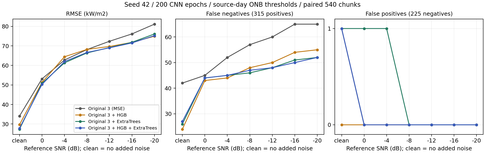

# 通常ONB・200 epochsの完了結果と次の研究判断

解析日：2026-10-07。対象は10/6開始の`onb_wc-t0611-v0611_ic3-nc_c1s_s0_e200_193305`、run hash `2366b492`、fit ID `c755ee5f162b`のみ。本人が実行した通常5モデルrunの保存結果を読み、再学習・新モデル推論・重み変更をせず解析した。過去結果と原runの出力は上書きしていない。

**判断：元3への追加による全域回帰と見逃し改善を今回も確認した。ただし5モデルが4モデル・単体を全指標で上回る証拠にはならない。次は、共通失敗と統合で追加した失敗を入力依存・統合設計の対照で説明し、修論本文へ反映する。**

## 1. 実行完了と評価条件

- clean／参照SNR 0, −4, −8, −12, −16, −20 dBの**7/7条件完了**。各`completed.json`は同じrun hash・fit ID。
- seed42、内部shuffleありchunk 3-fold、選別なし、3 kHz、生power 1秒入力。外側は既知36 WAVから各15 chunk、計540。学習は各45、計1620。内部分割3は外側評価を3回行った意味ではない。
- cleanのみで5単体と統合重みを学習し、全雑音へ同じfitを適用。Conformer/AlexNetは内部6＋最終2の**全8 fitが200 epochs完走**、batch12/8も要求値と一致。
- 保存5モデル×7条件×540＝**18,900予測**を再読込照合。最大差1.16×10⁻¹⁰ W/m²。保存重みでの統合42組も合格。
- 保存主表の11方式×7条件×日別2＋全体＝**231行**を予測CSVから再計算して一致。最大数値差5.68×10⁻¹⁴、5の再構成差4.55×10⁻¹³ kW/m²。
- [原runの主表](../../Pool_boiling/Subcooling_20_degrees/0.3/2025.06.11_0.3_2_6.18_0.3_3/regression_result/npy/ensemble/202610/06/onb_wc-t0611-v0611_ic3-nc_c1s_s0_e200_193305/maxfreq=3kHz/onb_comparison/main_comparison.md)と[今回の検算](verification.json)、[実条件](conditions.json)を参照。

原runの`status=passed`、`epochs_complete=true`であり、`normal_150_epoch_main_run_completed=false`と`standard_configuration=false`は**v1の名目150 epochsと200 epochsが異なるため**。smokeではなく、200 epochsの本runとして完了している。原reporterの「software smoke or nonstandard configuration」という総称を、未完了・実装スモークと読み替えない。名目150へ戻して完了フラグを立てるための再実行は不要。

主表は日別ONB 6/11＝221.5051102、6/18＝271.6776816 kW/m²で判定。全体540の陽性315／陰性225、近傍±10%は30。従来の平均閾値246.5913959による別CSVとは混在させない。日別q100は有限評価集合の到達熱流束であり、時間遅延ではない。

## 2. 元3に追加した効果

以下の誤差はkW/m²。元3は今回と同じ単体予測・clean OOF MSEで統合した対照。

| cleanの方式 | 全域RMSE | MAE | 近傍RMSE | FN | FP | Recall | F1 |
|---|---:|---:|---:|---:|---:|---:|---:|
| 元3 MSE | 34.07 | 25.95 | 39.58 | 42 | 1 | 86.67% | 0.92699 |
| 元3＋HGB | 29.64 | 19.94 | 24.91 | 24 | 0 | 92.38% | 0.96040 |
| 元3＋ExtraTrees | **27.35** | **18.39** | **13.37** | 26 | 1 | 91.75% | 0.95537 |
| 元3＋HGB＋ExtraTrees | 27.80 | 18.55 | 16.45 | 27 | 1 | 91.43% | 0.95364 |

元3→5では全域RMSE−6.27（18.40%減）、MAE−7.40（28.50%減）、FN−15（35.71%減）、Recall＋4.76pp、Accuracy 92.04→94.81%（＋2.78pp）、F1＋0.02665。Precisionは99.64→99.65%でほぼ同じ、FP1/FPR0.44%は残る。R² 0.98410→0.98941、連続ROC-AUC 0.99256→0.99392、PR-AUC（average precision）0.99497→0.99601。

| −20 dBの方式 | 全域RMSE | MAE | 近傍RMSE | FN | FP | Recall | F1 |
|---|---:|---:|---:|---:|---:|---:|---:|
| 元3 MSE | 81.14 | 62.46 | **93.92** | 65 | 0 | 79.37% | 0.88496 |
| 元3＋HGB | **74.95** | 56.41 | 100.74 | 55 | 0 | 82.54% | 0.90435 |
| 元3＋ExtraTrees | 76.11 | 55.98 | 98.38 | 52 | 0 | 83.49% | 0.91003 |
| 元3＋HGB＋ExtraTrees | 75.23 | **55.76** | 99.32 | 52 | 0 | 83.49% | 0.91003 |

元3→5では全域RMSE−5.90（7.28%減）、FN−13、Recall＋4.13pp、Accuracy87.96→90.37%（＋2.41pp）、F1＋0.02508、FP0を維持。保存標本でcleanは15訂正・追加FN0、−20は13訂正・追加FN0。

全7条件で元3より5の全域RMSEとFNが改善し、FPも増えていない。6雑音のRMSE算術平均は68.94→65.77。ただし**一律の改善ではない**：cleanのONB前RMSEは27.10→29.54、−20の近傍RMSEは93.92→99.32に悪化。−8／−12／−16では全域・FN改善と同時にROC/PR-AUCが低下する。−20−cleanのRMSE増加量も47.07→47.43で、雑音による劣化量が縮小したとはいえない。

## 3. 5モデルの追加利得を4・単体と分ける

5はET4に対しclean RMSE＋0.452、MAE＋0.158、FN＋1。同じWAVを日別に再標本化した記述的95%区間はclean RMSE差［−0.295, 1.196］、−20差［−1.746, 0.116］で、優越・同等を確定できない。元3→5のclean RMSE差は［−10.604, −1.949］。36 WAV単位のclean MSE改善は元3比28/36、ET4比17/36で、追加基準によって結論が異なる。

HGB4は今回**全7条件FP0**、clean FN24で5より少ない。一方、全域RMSEと6雑音平均は5がよい。ET単体もclean RMSE28.40では5より悪いが、MAE17.40・近傍RMSE9.73・FN19は5よりよく、FP2は5の1より多い。−20のHGB単体はRMSE74.19・FN49・FP0で5を上回る。単体・4・5の間に全指標を支配する一つの方式は確認できない。各条件の最良単体は事後的な記述対照であり、運用時に正解/SNRで切り替える方式ではない。

保存seed43／44（150 epochs）では5のclean RMSEはET4より0.068／0.111小さかった。今回seed42（200 epochs）では逆方向。**元3への追加の有用性は複数条件で支持され、5が4より優れるという主張は弱い**。今回と過去でseed・外側chunk分割・CNN epochが違うため、性能差を200 epochsの効果へ帰属させない。同じ録音を反復使用した開発結果であり、独立な3実験・未知日の検証と扱わない。

## 4. q100が改善・後退した理由

| cleanの日別q100（kW/m²） | 元3 | HGB4 | ET4 | 5 |
|---|---:|---:|---:|---:|
| 6/11 | 368.98 | 368.98 | 368.98 | 368.98 |
| 6/18 | 434.02 | 376.32 | **322.11** | 376.32 |

−20では4方式とも6/11＝368.98、6/18＝434.02で同じ。見逃し件数の改善はq100の前進を保証しない。

ET4→5のcleanは、2件訂正・3件追加FN。6/18の実測322.114、chunk55は、ET単体285.168、ET4 278.762で閾値271.678以上だったが、HGB247.606、5は268.527へ下がった。これがその日の最後のFNとなり、q100を322.114から次段階376.320へ戻した。**モデルを増やすと成功予測も引き下げることがある**という具体例である。

6/11は実測315.466に最後のFN1件があり、**全5モデルが陰性**。現在の5予測を非負平均するだけではこのchunkを陽性化できないため、6/18と同じ重み問題として扱わない。全14日別q100と最後のFNは[q100_last_false_negative.csv](q100_last_false_negative.csv)、訂正・追加chunkは[detection_change_cases.csv](detection_change_cases.csv)。

## 5. 残るFNと統合の役割

| 5の残るFN | 全5陰性 | 固定元3比率で3ブロックとも陰性 | 配分下限で到達不可 | 標本ごとは到達可能 | 合計 |
|---|---:|---:|---:|---:|---:|
| clean | 11 | 2 | 6 | 8 | 27 |
| −20 | 0 | 49 | 1 | 2 | 52 |

「固定元3比率で3ブロックとも陰性」は、単体の誰かが陽性でも、元3ブロック・HGB・ETは全部陰性という意味。配分下限の上限は`U=.25×元3+.05×HGB+.05×ET+.65×max(元3,HGB,ET)`。標本ごとの上限は正解を用いたoracle診断であり、単一の学習可能な重みやFP安全性を保証しない。

−20の49件を、元3総量25%の下限を下げるだけで必ず救えるとはしない。すべてのブロックが陰性なら、そのブロックの非負平均では救えず、元3内部比率・入力・学習器など別の変更が必要になる。元RFはこの条件でFN0だが**FP217/225**であるため、その陽性を有用な補完と即断しない。

今回の5の重みはRF1.462%、Conformer17.831%、AlexNet5.707%、HGB27.246%、ET47.754%。元3合計25%は制約下限に達する。clean OOF fit診断では5 RMSE28.495がET4 28.919を改善したが、外側cleanでは逆転した。fit目的が全域MSEで、q100・FP・領域別誤差を直接最適化していないことも交換の理由として整合する。

ET4に対するMSE差は`2E[e_ET4 δ]+E[δ²]`、`δ=予測5−予測ET4`で分解できる。今回両方式の元3重みが同じため、`δ=.272464×(予測HGB−予測ET)`。clean全域は＋3.961＋20.975＝**＋24.937**で悪化、−20全域は−159.027＋26.119＝**−132.908**で改善。HGBの調整方向が条件で変わり、単に「モデルが多いから相殺した」とは説明できない。[損失分解](loss_decomposition.csv)は恒等式を検算済みで、物理的原因の同定ではない。

## 6. 教授へ説明する採用理由

5は本人の「元3を保持して追加する」比較方針に沿う主構成として維持し、ET4・HGB4・ET単体も主結果で併記する。今回の外側値から既定を都度切り替えず、**追加の有用性と5全ての必須性を分ける**。

| モデル | 採用・比較上の理由 | 現時点での留保 |
|---|---|---|
| 元RF（PCA＋XGBRF） | 従来研究の木系画像入力を固定した基準を保持する | RFが精度上必須とは確認していない。−20の大きなFPと小さい統合重みも示す |
| CNN＋Transformer（表示名Conformer） | 従来の画像・系列入力モデルを保持する。保存削除対照にはclean回帰/FN悪化の根拠がある | 物理的な時間機構を学習したという証明ではない |
| AlexNet派生CNN | 従来CNNを保持して画像入力の異なる予測を比較する | 削除で回帰が悪化する一方、FNが減る場合もある |
| 周波数34特徴HGB | 明示的な音響要約を使う追加モデル。今回HGB4のFP抑制、強雑音全域の補完がある | ET4への追加ではclean FN/q100を悪化させた。RF一般の優越や常時有用性は主張しない |
| 同じ34特徴ExtraTrees | 保存2seedの学習側候補選択で選ばれ、clean回帰と近傍改善への寄与が大きい | 単体には今回clean FP2があり、統合・他の単体との交換がある |

前の[採用理由・削除対照](../../docs/notes/2026-10-06_five_model_rationale_and_next_steps.md)を今回の結果と合わせて読む。HGB/ETは同じ34特徴を用いるため、「独立した二つのセンサ情報」とは説明しない。どの入力特徴を利用するかは次の共通摂動で確認する。

## 7. 次の段階と識別条件

1. **今回の結果を主表・暫定結論・方法章へ固定する（今回の解析・記録は完了）。** 200 epochsを別条件として記載し、過去150 epochs表を保持する。「元3に対する回帰/FN改善」「4/単体/領域/q100との交換」を修論第5〜6章の主張へ反映する。全5・全条件FP0という一般化は取り下げ、保存seed43/44内の観測事実として残す。新しいモデル探索や良いseedが出るまでの反復を再開しない。
2. **最終5の共通入力摂動を優先する（未実施）。** 対象は今回の保存最終5＋固定重み、clean/−20の同じ全540 chunk。加工を同じ生powerへ与えてからPCA/34特徴を再計算する。10/6案に沿い、2.1–2.5 kHz減衰と同幅の対照帯域、全体gain0.5/2倍、時間並べ替えを実行前に固定する。全体/領域誤差・FN/FP・日別q100を集計し、最後の共通FNとHGBによる追加FNも規則に沿って図示する。時間並べ替えでHGB/ETが不変という構造対照を確認する。全モデルの同じ問いに対する依存を比較できれば終了し、マスク感度だけで沸騰音源を同定しない。
3. **元3内部比率の限定対照を行う価値がある（未実施）。** 今回も−20の52 FN中49件が固定ブロックで到達不可で、前2seedと同じ制約の問題が残るため。比較は現行固定元3比率MSEと、元3メンバーを全て保持し内部比率もclean学習OOFで決める非負MSEの2方式に限定する。元3総量25%・追加各5%は共通にして、比率固定の効果を区別する。基礎モデルの再学習は不要。clean/全7条件のFP・q100・全域/近傍を併記し、改善なしなら比率変更を主方式へ追加しない。外側ラベル・真の熱流束・SNRから重みを決めない。既に参照した外側への事後比較は開発検証として明記する。
4. **入力情報の不足が残る場合だけ、次の学習を一つ選ぶ。** 6/11の全5共通陰性を優先し、power中心／相対形状中心／全34の除去後再学習など、共通摂動では区別できない問いに限る。6・7個目のモデル追加や全gridは、訂正したい失敗と期待する入力情報を具体化できた場合だけ検討する。
5. **説明と執筆を並行する。** 主表、日別q100、モデル役割、失敗の2種類を教授向け説明と本文へ移す。未知日・追加同期映像・新しい人手確認を今回の進行条件へ戻さない。10/16は既存計画の仮準備目標で、正式な開催日・提出期限と扱わない。

未実施なのは上記の母集団入力摂動と限定比率対照。通常入口の本実行・保存再読込確認は今回終わったので、それらを待つ作業へ戻さない。新しい性能改善は現段階では約束せず、残る失敗に対する説明・識別が次の成果物となる。

## 8. 保存物と再計算

- [全7条件・6方式・3 runの比較](comparison_across_runs.csv)：seed42/200とseed43,44/150を分けて保存。元の231行・462行の主表は原保存先に保持。
- [訂正と追加の件数](paired_detection_changes.csv)、[該当chunk](detection_change_cases.csv)、[残るFNの区分](remaining_false_negatives.csv)、[q100を支配する最後のFN](q100_last_false_negative.csv)。
- [WAV別二乗誤差差](wav_error_changes.csv)、[日別層化paired WAV bootstrap](wav_cluster_bootstrap.csv)、[ET4/ET相対の損失分解](loss_decomposition.csv)、[学習OOF fit診断](oof_weight_fit_diagnostics.csv)。
- [図PNG](comparison.png)／[SVG](comparison.svg)、[実条件](conditions.json)、[入力SHA-256と検算](verification.json)。区間は固定済み予測を各日18 WAVから復元抽出した5,000回の記述値で、chunk独立・反復seed独立を仮定せず、学習・方式選択全体の不確かさや統計的な優越/同等を証明しない。
- 再計算：`python experiments/2026-10-07_onb_200epoch_result_analysis/analyze_saved_run.py`。既存TFGPU環境のnumpy/pandas/sklearn/matplotlibを使用し、依存追加なし。スクリプト内で主表231行・件数・保存予測再構成・損失恒等式を検算する。保存モデルの再読込推論は原runの完了記録を確認し、今回再実行していない。
