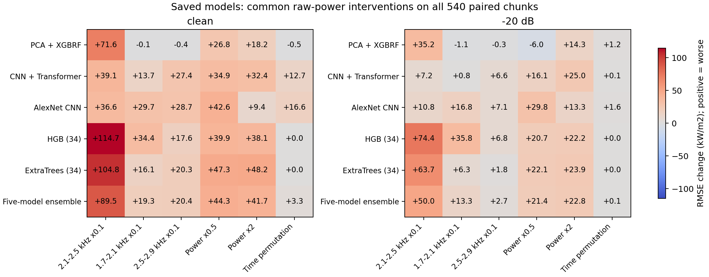
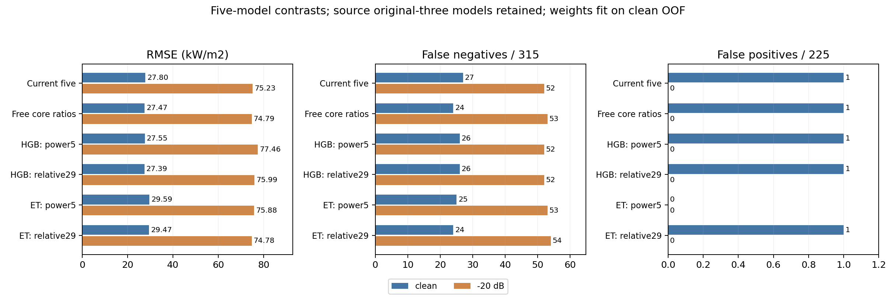

# 最終5の入力依存・元3内部配分・入力除去後再学習

実施日：2026-10-07。本人の「初めの3つを実行して進める」依頼に基づき、[200 epochs本run](../2026-10-07_onb_200epoch_result_analysis/README.md)を対象に3段階を**実装・実行・検算・判断まで完了**した。条件は[実行前に固定したプロトコル](../../configs/experiments/2026-10-07_onb_input_and_integration_protocol.json)。原run・最終モデル・元3予測・通常ONB設定と過去結果を保持した。

**総合判断：主構成は現行の元3＋全34特徴HGB＋全34特徴ExtraTrees、固定元3比率・clean OOF MSEのまま維持する。** 比率自由化はcleanの追加改善を示す比較方式として残す。入力除去後の4構成は採用へ昇格しない。2.1–2.5 kHzへの依存、絶対powerと相対形状の併用、統合配分による交換を具体的に説明できる結果が得られた。一方、6/11 q100を支配する最後の共通陰性は解消していない。

## 1. 対象と完了確認

| 項目 | 固定した範囲・実績 |
|---|---|
| 元run | `onb_wc-t0611-v0611_ic3-nc_c1s_s0_e200_193305/maxfreq=3kHz`、hash `2366b492`、fit ID `c755ee5f162b` |
| 評価 | 6/11＋6/18、既知36 WAV内の未使用540 chunk（各WAV15）、陽性315・陰性225。日別ONB閾値を使用 |
| 学習 | cleanの1620 chunk（各WAV45）、保存と同じ内部shuffleあり3-fold。外側chunkはfitへ含めない |
| 第1段階 | 保存5×clean/−20×7加工×540＝37,800モデル予測、462指標行。新学習0、未加工再現・時間不変・gain対照合格 |
| 第2段階 | clean OOFだけで配分をfit、全7条件を評価。基礎モデル学習/推論0。2開始点の制約付き解が一致 |
| 第3段階 | 同じHGB/ETの2表現×内部3＋最終1＝16モデルfit、CNN fit0、新モデル系列0。全16モデル/target scalerを保存・再読込検証 |
| 第3段階の最終再読込 | 新4 Pipelineの全7×540＝15,120予測を照合。保存全34の2 Pipelineも7,560予測を再現。432指標行 |
| 追加の損失診断 | 重み固定/再fit対照216行、損失分解256行。保存予測だけを使用、追加学習/モデル推論0 |
| 元指標の検算 | 各段階の元方式66/231/231行を元run主表と再照合。原入力ファイル、16新モデル/16 scalerのhash一致 |

検算正本：[全体](verification.json)、[第1段階](stage1/verification.json)、[第2段階](stage2/verification.json)、[第3段階](stage3/verification.json)、[使用コードのhash](code_fingerprint.json)。内部fold数は外側評価の反復数ではない。今回も反復参照した研究データの開発比較であり、未知録音での独立試験とは扱わない。

## 2. 第1段階：全モデルに同じ入力加工を与える

モデル・PCA・target scaler・重みを固定し、生powerの同じ時間/周波数軸を加工した。帯域は現行34特徴と同じresize後の近似Hz座標で、3帯域はいずれも30列。2.1–2.5 kHzをpower0.1倍とし、1.7–2.1/2.5–2.9 kHzも同じ強度・幅で対照化した。全体gain0.5/2倍、固定seedの224時間行の並べ替えを追加した。これらは学習時のデータ拡張ではなく、保存モデルの人工的な入力依存検査。

| 5統合のclean加工 | 全域RMSE（kW/m²） | FN | FP | 6/11 q100 | 6/18 q100 |
|---|---:|---:|---:|---:|---:|
| 未加工 | 27.80 | 27 | 1 | 368.98 | 376.32 |
| 2.1–2.5 kHz×0.1 | 117.28 | 97 | 0 | 427.28 | 496.02 |
| 1.7–2.1 kHz×0.1 | 47.11 | 43 | 0 | 368.98 | 434.02 |
| 2.5–2.9 kHz×0.1 | 48.23 | 45 | 0 | 368.98 | 434.02 |
| 全体power×0.5 | 72.14 | 27 | 1 | 368.98 | 376.32 |
| 全体power×2 | 69.48 | 38 | 1 | 368.98 | 376.32 |
| 時間行を並べ替え | 31.10 | 32 | 0 | 368.98 | 376.32 |

**確認事実**：2.1–2.5 kHz加工の悪化は前後の同幅帯域より大きく、−20でも5のRMSE75.23→125.23、FN52→101。両要約モデルに対しても大きい。時間並べ替えではHGB/ETの34特徴・予測は不変、CNN＋Transformerのclean RMSE35.34→47.99、AlexNet39.88→56.45。34特徴の時間集計では順序を失うという構造対照も一致した。全体gainは、floorが働かない今回の入力では絶対log power5特徴のみを変え、残り29特徴を保つことを数値で確認した。

**整合する解釈**：現在のモデルは2.1–2.5 kHzを含む形状と絶対強度へ依存し、CNN系には時間配置への依存もある。全体gainに対し回帰は悪化するが、見逃しは必ず増えるわけではない。−20 gain2倍では5のFN52→49でもRMSE75.23→97.98となり、判定と回帰の交換がある。1.7–2.1 kHz減衰では−20 HGB単体のFP0→86で、帯域相対量にも脆弱性が残る。

**断定しないこと**：大きな感度は、沸騰音源の同定、その帯域だけの必要性、時間配置が真の気泡発生時刻を表すことを証明しない。加工が学習分布を外す可能性がある。無情報帯域との比較でもない。5に残る元のclean共通FN11件は全7加工で陰性のままだったが、これだけで入力に情報がないとはいえない。



[全指標](stage1/metrics.csv)、[差](stage1/metric_deltas.csv)、[訂正/追加](stage1/paired_detection_changes.csv)、[特徴の変化](stage1/feature_intervention_checks.csv)。全common FN、ET4/5判定差、日別最後のFNという事前の抽出規則による[代表例全予測](stage1/representative_case_predictions.csv)と[図](endpoint_cases.png)を、全540の集計とは区別する。

## 3. 第2段階：元3内部比率だけを自由にする

現行固定比率と、同じclean OOFで元3内部比率もMSE最小化する対照を比較した。元3総量25%以上、追加各5%以上、元3各メンバーが元3ブロック内の1e−6以上、全重み和1を共通に保持。外側正解、雑音OOF/雑音予測、真のSNRを配分fitへ入れない。

| 比較 | clean RMSE | clean FN/FP | −20 RMSE | −20 FN/FP | clean日別q100（6/11、6/18） |
|---|---:|---:|---:|---:|---|
| 現行固定元3比率 | 27.80 | 27 / 1 | 75.23 | 52 / 0 | 368.98、376.32 |
| 元3内部比率も自由 | 27.47 | 24 / 1 | 74.79 | 53 / 0 | 368.98、376.32 |

cleanでは3件訂正・追加FN0、学習OOF fit診断でもRMSE28.495→28.319、FN72→67。−20では追加FN1、近傍RMSE99.32→102.13。−12の全域誤差もわずかに悪化。全7条件の日別q100は現行と同じで、元のclean共通FN11件も残る。fitに使ったOOFの値を独立なmeta検証として扱わない。

自由比率の重みはRF0.000025%、Conformer16.882%、AlexNet8.118%、HGB26.991%、ET48.009%。元3総量25%は維持するが、**RFは数値上の保持下限まで下がり、実質的な寄与はほぼない**。5メンバーが正の値であることを、全5の必要性の証拠にはしない。

判断：cleanの補助改善は記録し、比率自由化を限定対照として残す。見逃し・近傍・q100に一律の改善はなく、元3固定比率の主設計を今回の一つの外側結果だけで切り替えない。[固定した配分](stage2/frozen_weights.json)、[指標](stage2/metrics.csv)、[指標差](stage2/metric_deltas.csv)、[変更された判定区間](stage2/changed_detection_cases.csv)。

## 4. 第3段階：入力を除去して同じ学習器で再学習する

第1・2段階でもclean共通FN11件と絶対power/形状の依存が残ったため、条件付き第3段階へ進んだ。モデル系列・hyperparameterを増やさず、同じHGB/ETで以下を比較した。

- 全34：保存モデル/OOFを再利用する基準。
- 絶対power5：4帯域と全体のlog power。
- 相対形状等29：帯域比率2、centroid、entropy、時間power CV、相対log band power24。CVは時間順序を含まない。

同じ1620 clean、同じ内部3分割、各fit内だけのMinMax target scaler、内部seed43/44/45・最終43、現行学習器paramsを使用。2学習器×2削除表現×4 fit＝16。OOFのcoverage1と非共有を確認し、全モデル・scalerを保存/再読込した。外側の値からhyperparameter・表現を選び直していない。

| 単体 | clean OOF RMSE | clean外側RMSE | clean FN/FP | −20 RMSE | −20 FN/FP |
|---|---:|---:|---:|---:|---:|
| HGB 全34 | **32.11** | **33.25** | 21 / 0 | **74.19** | 49 / 0 |
| HGB power5 | 49.74 | 44.71 | 25 / 2 | 129.78 | 30 / 106 |
| HGB 相対29 | 50.84 | 46.46 | 18 / 0 | 93.77 | 52 / 0 |
| ET 全34 | **29.62** | **28.40** | 19 / 2 | **75.43** | 50 / 1 |
| ET power5 | 46.22 | 40.85 | 29 / 1 | 120.38 | 24 / 113 |
| ET 相対29 | 49.17 | 41.77 | 23 / 1 | 80.09 | 51 / 0 |

両学習器とも、全34のclean学習側/外側と−20全域RMSEが最も小さい。相対29のみでは絶対powerだけの強雑音FP増加を抑えるが、全34より回帰が悪い。**現在の学習器・固定params・分割の範囲では、絶対powerと相対形状を併用する根拠が得られた。** 学習器の特徴数・分岐の変化も伴うため、各特徴の唯一の情報量や物理的因果を確定する実験ではない。

power5 HGBの−20・6/11はq100が約0 kW/m²になったが、ONB前の**105/105件が誤報**。全体FP106であり、安全な早期ONB検知とはいえない。q100をFPから切り離して最適値として採用しない具体例となる。

元共通FN11件のうち、power5 HGB単体は4件、power5 ET単体は1件を訂正した。ただし他の区間に追加FN/FPがあり、既存の固定元3比率MSEで5へ統合すると、どの削除表現でも元共通11件は全て残る。**共通失敗は入力の情報不在を証明しない**。表現/学習の変更で訂正できる例と、統合でその訂正が失われる例を分ける。

最後の6/11・実測315.466・chunk21は、新4単体も全て陰性。power5 HGB140.45、相対29 HGB76.68、power5 ET174.39、相対29 ET80.87 kW/m²で、閾値221.505を超えない。今回の変更でも6/11のq100368.98は前進していない。[元共通失敗の全予測](stage3/original_common_fn_cases.csv)。

## 5. 入力変更と統合配分の効果を分ける追加対照

第3段階の各単体は元3を保持した5へ組み込み、同じ固定元3比率・clean OOF MSEで配分をfitした。HGB削除表現2つともHGB5%の下限・ET70%となったため、入力変更と配分変更の説明を区別する必要が生じた。そこで[事後の診断プロトコル](../../configs/experiments/2026-10-07_onb_fixed_weight_control.json)を追加し、**元の重みのままの統合**も保存予測から計算した。新学習・新推論・新候補選択はしていない。

| HGBを相対29へ変更するclean対照 | RMSE | FN/FP | 6/18 q100 |
|---|---:|---:|---:|
| 元の全34・元の重み | 27.80 | 27 / 1 | 376.32 |
| 相対29・元の重み | 29.06 | 27 / 1 | 376.32 |
| 相対29・OOFで重み再fit | 27.39 | 26 / 1 | 322.11 |

clean MSE差を分けると、入力変更だけで＋71.78、そこから重み変更で−94.56 (kW/m²)²。今回のq100前進は元の重みでは生じず、**HGB27.25%→5%へ下げ、ET4に近づいた配分を伴う**。単に「相対形状を使ったため検知が良くなった」と説明しない。

| clean OOFで配分を決めた5構成 | clean RMSE | clean FN/FP | −20 RMSE | −20 FN/FP | 6雑音平均RMSE |
|---|---:|---:|---:|---:|---:|
| 現行全34・固定元3比率 | 27.80 | 27 / 1 | 75.23 | 52 / 0 | **65.77** |
| 元3比率自由 | 27.47 | 24 / 1 | 74.79 | 53 / 0 | — |
| HGBをpower5へ | 27.55 | 26 / 1 | 77.46 | 52 / 0 | 66.38 |
| HGBを相対29へ | 27.39 | 26 / 1 | 75.99 | 52 / 0 | 65.86 |
| ETをpower5へ | 29.59 | 25 / 0 | 75.88 | 53 / 0 | 66.98 |
| ETを相対29へ | 29.47 | 24 / 1 | 74.78 | 54 / 0 | 66.50 |

削除表現4方式は全て、統合のclean OOF全域RMSEも現行28.495より悪い。HGB変更方式は0/−4で新たなFP1を出す条件がある。ET power5統合は全7条件FP0になるが回帰が悪い。相対29 HGBのq100利得はET4にも既にある。clean一部の値だけを根拠に既定へ昇格させない。



[全7条件の主比較](main_comparison.csv)、[削除対照全指標](stage3/metrics.csv)、[配分](stage3/frozen_integration.json)、[固定重み対照](stage3/fixed_weight_control_metrics.csv)、[損失分解](stage3/input_weight_loss_decomposition.csv)、[訂正/追加](stage3/paired_detection_changes.csv)。MSEは入力変更時と配分変更時それぞれ`2E[eδ]+E[δ²]`へ分け、恒等式を検算した。区分は記述的な効果分解で、原因の物理的実証ではない。

## 6. 採用判断と次にすること

1. **主設定は全34のHGB/ET＋元3固定比率を維持する。** 元3保持の研究設計、学習側の入力比較、全7条件の回帰/FN/FP交換を合わせた判断。通常ONBや最終重みを変更していない。比率自由化はcleanの追加利得を示す対照、入力削除方式は依存・不成立を説明する対照として残す。誤報の新しい許容値をAI側で運用事実として設定した判断ではない。
2. **今回の3段階を追加モデルの説明根拠に使う。** HGB/ETは同じ34特徴・順序不変の入力から異なる予測を出し、CNNは時間配置にも依存する。絶対powerと相対形状を併用する回帰上の根拠と、単体の訂正が統合で失われる交換を示す。感度から沸騰機構を同定したとは説明しない。
3. **性能改善をさらに狙うなら、問いを最後の6/11失敗へ絞る。** 同じWAVの成功chunk、学習側の近いpower/形状のchunkと時間局在を比較し、要約で失われる情報か、入力が低熱流束と重なるかを識別する。今回の追加4モデルも315.47のchunk21を救えないため、重みgridや名前だけの新モデル探索を次の第一手にしない。以前の時間46候補比較を未実施として再実行しない。
4. **比率自由化の主採用を再検討するときだけ、保存seed43/44でも同じ規則を確認する。** 基礎モデルの再学習なしで可能だが、今回の3段階の終了条件ではなく未実施の後続候補。研究上の独立性が増える検証ではない。

今回の3段階は終了した。残るq100問題を未解決として保持し、追加モデル・再学習を無制限に続けない。本人の4番目だった本文執筆をこの実験完了と混同しない。追加同期映像・未知日・新しい人手確認を進行条件へ戻さない。

## 7. 再実行と成果物

同じTFGPU環境・CPU threads2を使用。第1段階は元runと同じGPU経路を要求し、第2・3・解析はCPUで実行できる。依存追加なし。

```powershell
python experiments/2026-10-07_onb_input_and_integration/stage1_common_interventions.py
python experiments/2026-10-07_onb_input_and_integration/stage2_free_core_ratio.py
python experiments/2026-10-07_onb_input_and_integration/stage3_input_removal.py
python experiments/2026-10-07_onb_input_and_integration/analyze_followup.py
```

既に全て実行済み。`analyze_followup.py`だけなら追加のモデルfit/推論なしで、保存予測の診断・図・原指標とhashの検算を再生成する。段階1〜3のスクリプト再実行は、この新しい実験フォルダ内の当該段階の生成物を再作成する。

- 第1段階：[モデル別・全540の全加工予測](stage1/base_predictions.npz)、[特徴対照](stage1/feature_intervention_checks.csv)、[母集団変化量](stage1/prediction_change_summary.csv)。
- 第2段階：[配分](stage2/frozen_weights.json)、[全7条件の予測](stage2/predictions.csv)、[訂正/追加](stage2/paired_detection_changes.csv)。
- 第3段階：[16モデルのfit/scaler一覧](stage3/model_fit_audit.csv)、[モデル](stage3/models)、[全7条件の再読込確認](stage3/final_reload_checks.csv)、[clean OOF予測](stage3/oof_predictions.npz)、[外側予測](stage3/predictions.csv)。
- 図はPNG/SVGの両方を保存：[依存](stage1_effects.svg)、[統合対照](integration_and_input_comparison.svg)、[最後のFN](endpoint_cases.svg)。
- 原run/元モデル/元重みを全段階の前後でSHA-256照合し、16新モデル/scalerも再検算。固定重み追加対照と図は保存値から計算し、fitを繰り返していない。
